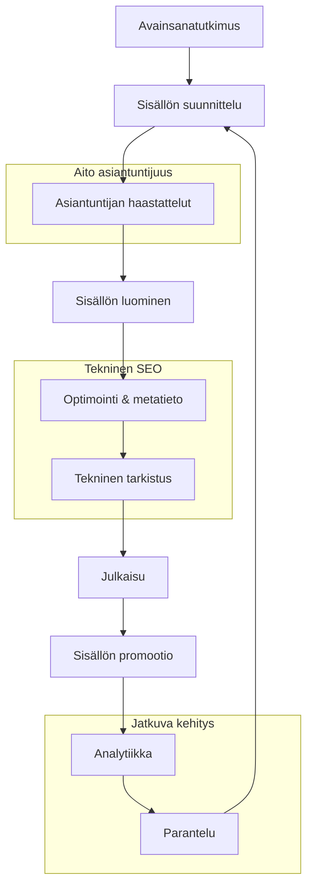

# Hakukoneoptimointi B2B-näkökulmasta 2025

Hakukoneoptimointi (SEO) on edelleen vuonna 2025 yksi tärkeimmistä B2B-markkinoinnin keinoista liidien tuottamiseen. Hakukoneet ovat monille B2B-ostajille ensimmäinen kanava etsiä ratkaisuja liiketoiminnan haasteisiin, ja hyvä näkyvyys oikeissa hauissa tuottaa laadukkaita liidejä.

## E-E-A-T-kriteerien kriittinen merkitys

Googlen ja muiden hakukoneiden algoritmit painottavat vuonna 2025 entistä enemmän E-E-A-T-kriteereitä (Experience, Expertise, Authoritativeness, Trustworthiness). B2B-sisällöissä tämä korostuu erityisen voimakkaasti, sillä ostopäätösten taustalla on usein kompleksisia, teknisiä kysymyksiä.

Käytännön toimenpiteet E-E-A-T-kriteerien vahvistamiseksi sisällöissä:

- **Identifioi oikeat asiantuntijat** - Sisällön kirjoittajaksi ja/tai kommentoijaksi kannattaa merkitä yrityksen aito asiantuntija, jolla on todistettavaa kokemusta aiheesta.
- **Tuo esiin referenssit ja sertifikaatit** - Kirjoittajan bio, LinkedIn-profiili ja sertifikaatit vahvistavat asiantuntemuksen.
- **Viittaa luotettaviin lähteisiin** - Ulkopuoliset lähteet ja viittaukset vahvistavat sisällön luotettavuutta.
- **Käytä tuoreita tilastoja ja tutkimuksia** - Vuoden 2024-2025 data osoittaa sisällön ajantasaisuuden.

Tuore tutkimustieto osoittaa, että hakukoneet osaavat yhä paremmin erottaa aidon asiantuntemuksen keinotekoisesta. Googlen "Helpful Content" -järjestelmän uusimmat päivitykset painottavat sisältöä, joka tarjoaa ainutlaatuista näkemystä ja kokemusta sen sijaan, että vain toistaisi olemassa olevaa tietoa.

## B2B-SEO-prosessi 2025

B2B-hakukoneoptimointi on vuonna 2025 yhä enemmän prosessi kuin yksittäinen toimenpide. Tehokkaan B2B-SEO-prosessin vaiheet:

1. **Avainsanatutkimus** - Selvitä, millä termeillä B2B-ostajat hakevat tietoa. Painota "long-tail" -avainsanoja, jotka kuvaavat tarkempia ongelmia ja kysymyksiä.

2. **Sisällön suunnittelu** - Tunnista sisältöaukot ja priorisoi sisällöt, jotka vastaavat hakijoiden aitoihin tarpeisiin.

3. **Asiantuntijan haastattelut** - Kerää aitojen asiantuntijoiden näkemyksiä, kokemuksia ja tietoa.

4. **Sisällön luominen** - Tuota laadukasta, ainutlaatuista sisältöä, joka tarjoaa todellista arvoa.

5. **Optimointi ja metatieto** - Varmista tekniset elementit kuten meta-otsikot, -kuvaukset, otsikkohierarkia ja sisäinen linkitys.

6. **Tekninen tarkistus** - Tarkista sivun latausnopeus, mobiilioptimointi ja muut tekniset hakukoneoptimoinnin osa-alueet.

7. **Julkaisu** - Julkaise sisältö oikeassa formaatissa ja oikeaan aikaan.

8. **Sisällön promootio** - Edistä sisällön näkyvyyttä sosiaalisessa mediassa, sähköpostimarkkinoinnissa ja muissa kanavissa.

9. **Analytiikka** - Seuraa sisällön suoriutumista ja kerää dataa.

10. **Parantelu** - Päivitä sisältöä analytiikan perusteella ja pidä se ajantasaisena.

## Teknisen SEO:n tärkeimmät elementit 2025

Tekninen hakukoneoptimointi on yhä B2B-markkinoinnin perusta. Vuoden 2025 tärkeimpiä teknisiä elementtejä ovat:

1. **Core Web Vitals** - Sivuston suorituskyky on yhä keskeisempi rankkaustekijä, erityisesti mobiilissa. Painopisteenä on LCP (Largest Contentful Paint) alle 2,5 sekuntia, FID (First Input Delay) alle 100ms, ja CLS (Cumulative Layout Shift) alle 0,1.

2. **Skeema-merkinnät (schema markup)** - Strukturoitu data auttaa hakukoneita ymmärtämään sisältöä. B2B-kontekstissa erityisen hyödyllisiä ovat:
   - FAQ-skeema kysymys-vastaus -sisällöille
   - HowTo-skeema ohjeistuksille
   - Article-skeema blogikirjoituksille
   - Product-skeema tuotteille ja palveluille

3. **Mobiilioptimoidut sisällöt** - B2B-päättäjät käyttävät yhä enemmän mobiililaitteita, jopa 65% työhön liittyvistä hauista tehdään mobiilissa vuonna 2025.

4. **HTTPS ja tietoturva** - Tietoturvallisuus on sekä hakukonesijoitusten että käyttäjäluottamuksen perusta.

5. **Sisäinen linkitys** - Selkeä sivustorakenne ja järkevä sisäinen linkitys auttavat hakukoneita ymmärtämään sisältöjen välisiä suhteita.

## Käyttäjäkokemukseen perustuva optimointi

Vuonna 2025 hakukoneet arvioivat sisältöjä yhä enemmän käyttäjäkokemuksen perusteella. Tämä näkyy mm. bounce rate -analytiikassa, sivuilla vietetyssä ajassa ja sivuilla navigoinnissa. B2B-markkinoijalle tämä tarkoittaa:

- **Sisällön selkeys ja jäsentely** - Hyvin strukturoitu sisältö väliotsikoineen, listoineen ja korostuksineen
- **Informaatiohierarkia** - Tärkeimmät tiedot ensin, yksityiskohdat myöhemmin
- **Toimintakehotukset (CTA)** - Selkeät seuraavat askeleet käyttäjälle
- **Harkittu visuaalisuus** - Relevantit kuvat, infograafit ja videot tukemassa tekstiä

## AI-generoitu sisältö ja hakukoneet

Hakukoneet tunnistavat vuonna 2025 entistä paremmin puhtaasti AI-generoidun sisällön. Googlen uusimmat algoritmipäivitykset pyrkivät suosimaan sisältöä, joka osoittaa aitoa asiantuntemusta ja ihmisen näkemystä.

Suositukset AI-työkalujen käyttöön B2B-sisällöntuotannossa:

1. **AI apuvälineenä, ei korvaajana** - Käytä tekoälyä auttamaan tutkimuksessa, ideoinnissa ja ensimmäisissä luonnoksissa, mutta varmista, että lopullinen sisältö sisältää aitoa asiantuntijakokemusta ja -näkemystä.

2. **Todellisten kokemusten lisääminen** - Täydennä sisältöä konkreettisilla esimerkeillä, tapaustutkimuksilla ja henkilökohtaisilla kokemuksilla, joita tekoäly ei voi luoda.

3. **Älä tyydy geneeriseen** - Vältä yleispätevää sisältöä, joka voisi sopia mille tahansa yritykselle. Kohdenna sisältö tarkasti omaan toimialaasi ja asiakkaidesi tarpeisiin.

## Suomenkieliset vs. englanninkieliset sisällöt

Suomessa toimivalle B2B-yritykselle kielivalinta on strateginen päätös:

- **Suomenkielinen sisältö** - Vähemmän kilpailtu, mutta pienempi potentiaalinen yleisö. Erityisen arvokasta, jos kohdeyleisösi on suomalaisia päättäjiä.
- **Englanninkielinen sisältö** - Laajempi potentiaalinen yleisö, mutta kovempi kilpailu. Välttämätöntä kansainvälisille markkinoille tähtääville.

Vuonna 2025 monet suomalaiset B2B-yritykset hyödyntävät kaksikielistä strategiaa:

1. **Verkkosivujen perusrakenne molemmilla kielillä**
2. **Blogisisältöjä kummallakin kielellä kohdennettuna eri yleisöille**
3. **Teknistä dokumentaatiota pääosin englanniksi**
4. **Asiakasreferenssejä ja tapaustutkimuksia valikoiden molemmilla kielillä**

Kokonaisuudessaan hakukoneoptimointi B2B-kontekstissa on vuonna 2025 yhä enemmän tasapainoilua teknisen optimoinnin ja aidon asiantuntijasisällön tuottamisen välillä. Parhaiten menestyvät ne yritykset, jotka onnistuvat yhdistämään molemmat aspektit ja tuottamaan sisältöä, joka todella palvelee B2B-ostajien tarpeita.

[← Edellinen osio: Johdanto](johdanto.md) | [→ Seuraava osio: LinkedIn ja ammatilliset verkostot](linkedin.md)