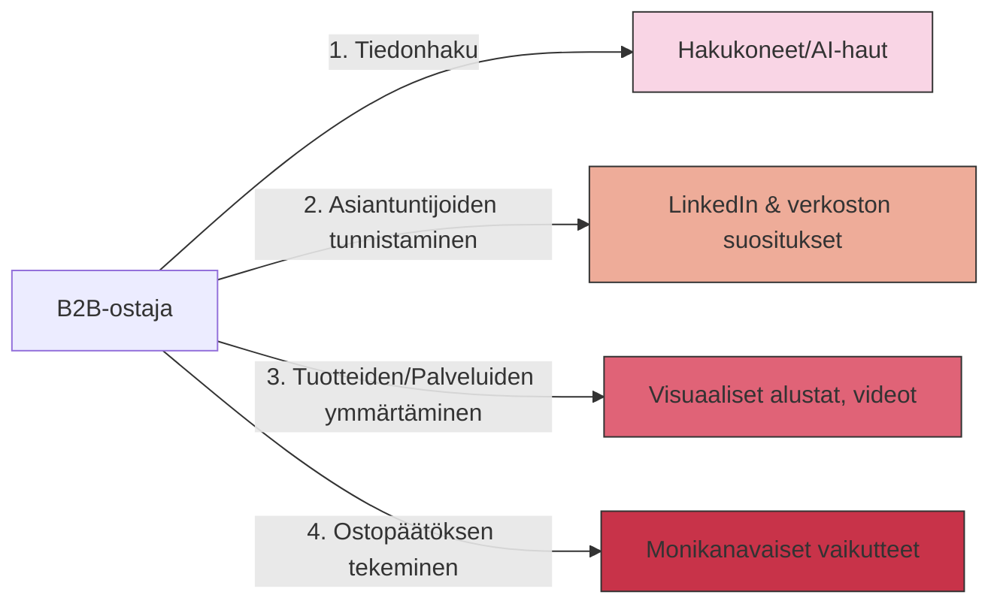

# Johdanto

B2B-ostajien tiedonhaun tavat ovat edelleen kehittyneet vuoden 2025 aikana. Uusimmat tutkimukset osoittavat, että jopa 80% B2B-ostopäätöksistä alkaa digitaalisella tutkimuksella, ja 75% ostajista on edennyt ostopolullaan merkittävästi ennen ensimmäistä yhteydenottoa myyntiin. Digitaalisilla alustoilla löydettävyys on siis yhä kriittisempi osa B2B-markkinointia.

Tämä raportti tarjoaa ajantasaisen katsauksen B2B-sisältöjen löydettävyyteen neljällä keskeisellä alueella: hakukoneet, LinkedIn, visuaaliset alustat kuten Instagram, sekä uudet generatiiviset hakukokemukset (tekoälyavusteiset hakukoneet). Keskitymme vuoden 2025 trendeihin ja tarjoamme konkreettisia vinkkejä suomalaisille B2B-markkinoijille.

## Markkinoinnin digitaalisen kentän muutokset

Viimeisten vuosien aikana B2B-markkinoinnin digitaalinen kenttä on kokenut kolme merkittävää muutosta:

1. **Tekoälyn läpimurto** - Generatiivinen AI on muuttanut sekä sisällöntuotantoa että hakukoneita. Tekoälyllä on kaksoisrooli: se toimii sekä työkaluna sisällöntuotannossa että kanavana, jonka kautta tietoa kulutetaan.

2. **Asiantuntijuuden korostuminen** - Algoritmit tunnistavat ja palkitsevat aidon asiantuntemuksen yhä paremmin. E-E-A-T-kriteerit (Experience, Expertise, Authoritativeness, Trustworthiness) ohjaavat sekä hakukoneita että sosiaalisen median alustoja.

3. **Yhteisöjen merkitys** - Laajan massayleisön tavoittelun sijaan B2B-markkinoinnissa painotetaan nyt kohdennettuja niche-yhteisöjä. Pienemmät, asiasta aidosti kiinnostuneet yleisöt sitoutuvat sisältöihin voimakkaammin.

Lisäksi keskeinen muutos on ostoprosessien monimutkaisuus: B2B-ostopolut ovat vuonna 2025 entistä kompleksisempia, ja informaation etsiminen ja kuluttaminen tapahtuu monissa eri kanavissa. Ostopäätöksissä on usein mukana laajempi tiimi, jonka jäsenet käyttävät eri kanavia ja hakevat erilaista tietoa.

Tämä raportti auttaa B2B-markkinoijia navigoimaan muuttuvassa ympäristössä ja varmistamaan, että heidän sisältönsä löydetään oikeissa kanavissa oikeilla tavoilla.

## B2B-markkinoinnin sisältömuotojen kehitys

B2B-markkinoinnin sisältömuodot ovat myös kehittyneet. Vuonna 2025 korostuvat erityisesti:

- **Vuorovaikutteiset sisällöt** - Passiivisten sisältöjen sijaan B2B-ostajat arvostavat vuorovaikutteisia kokemuksia, kuten interaktiivisia laskureita, testejä ja työkaluja.

- **Video ja multimedia** - Lyhyet, informatiiviset videot ovat yhä tärkeämpiä myös B2B-kontekstissa, erityisesti monimutkaisissa tuotteissa tai palveluissa.

- **Mikrosisällöt** - Tiiviit, nopeasti kulutettavat sisällöt täydentävät laajempia materiaaleja.

- **Kokemuspohjaiset narratiivit** - Aidot kokemukset ja tapaustutkimukset asiantuntijoiden kertomina ovat tehokkaampia kuin abstraktit hyödyt.

Seuraavissa osioissa perehdymme tarkemmin siihen, miten nämä trendit vaikuttavat eri kanavissa ja miten B2B-markkinoijat voivat optimoida sisältöjään maksimaalisen löydettävyyden varmistamiseksi.

[→ Seuraava osio: Hakukoneoptimointi B2B-näkökulmasta 2025](hakukoneoptimointi.md)