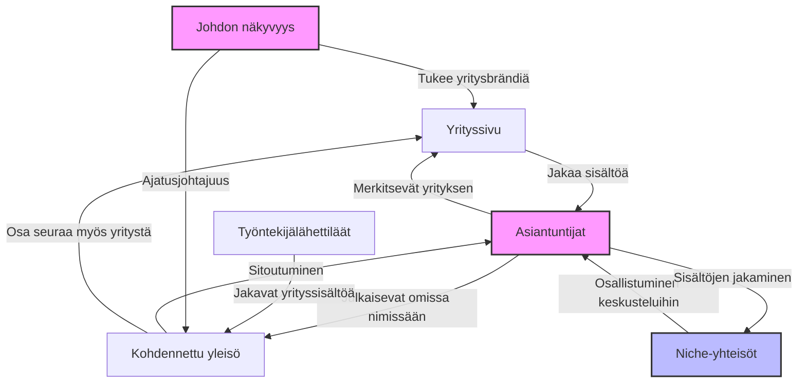

# LinkedIn ja ammatilliset verkostot

LinkedIn on vuonna 2025 edelleen B2B-markkinoijien tärkein sosiaalisen median kanava. Alustalla on maailmanlaajuisesti jo yli miljardi käyttäjää, ja pelkästään Pohjoismaissa yli 12 miljoonaa käyttäjää. Suomessakin LinkedInin käyttäjiä on yli 1,5 miljoonaa, mikä tekee siitä merkittävän kanavan myös kotimaassa toimiville B2B-yrityksille.

## Algoritmin toiminta ja painotukset 2025

LinkedInin algoritmi on kehittynyt vuoteen 2025 mennessä korostamaan entistä enemmän aitoa asiantuntijuutta ja yhteisön rakentamista. Uusimmat algoritmimuutokset painottavat:

1. **Niche-yhteisöjen vuorovaikutusta** - Aiemmin algoritmi korosti yleistä sitoutumista (tykkäykset, kommentit), mutta nykyään se painottaa erityisesti kohdennetun asiantuntijayleisön reaktioita.

2. **Asiantuntijoiden tunnistamista** - LinkedIn tunnistaa yhä paremmin, kenellä on todellista asiantuntemusta tietyllä alalla, analysoimalla profiilitietoja, sisältöhistoriaa ja ammatillisia saavutuksia.

3. **Keskustelujen laatua** - Pinnalliset kommentit ("Hyvä postaus!") saavat vähemmän painoarvoa kuin syvälliset keskustelut, jotka lisäävät arvoa aiheeseen.

4. **Sisällön aiheenmukaisuutta** - Algoritmi palkitsee johdonmukaisuuden; kun julkaiset säännöllisesti tietystä aihepiiristä, LinkedIn tunnistaa sinut sen asiantuntijaksi.

Käytännössä tämä tarkoittaa, että satunnainen sisällön julkaisu ilman selkeää fokusta tuottaa vuonna 2025 vähemmän tuloksia kuin koskaan aiemmin. Sen sijaan asiantuntijasisällön johdonmukainen julkaisu tietyistä teemoista parantaa näkyvyyttä merkittävästi.

## Henkilöbrändin ja yrityssivun yhteispeli

Vuonna 2025 B2B-markkinoinnissa korostuu henkilöbrändien ja yritysbrändin symbioosi. Henkilöbrändit tavoittavat algoritmin vuoksi laajemman yleisön, mutta yrityssivu toimii sisältöjen keskuksena. Tehokas strategia sisältää:

1. **Johdon näkyvyys** - Johtajien aktiivinen sisällöntuotanto tuo uskottavuutta ja näkyvyyttä. Vuonna 2025 jopa 78% B2B-ostajista tutkii potentiaalisen toimittajan johtoa LinkedInissä ennen ostopäätöstä.

2. **Asiantuntijoiden näkyvyys** - Teknisten asiantuntijoiden, konsulttien ja suorassa asiakasrajapinnassa toimivien henkilöiden aktiivisuus LinkedInissä rakentaa luottamusta.

3. **Työntekijälähettilyys** - Järjestelmällinen ohjelma, jossa työntekijät jakavat yrityksen sisältöjä omissa verkostoissaan moninkertaistaa näkyvyyden.

4. **Yrityssivun sisältöstrategia** - Vaikka henkilöt tavoittavat laajemmin yleisöä, yrityssivu toimii "kotipesänä", josta sisältöä jaetaan ja jonne vierailijat ohjataan tarkempaa tietoa varten.

## Tehokkaimmat sisältömuodot LinkedInissä 2025

Viimeisimmät tutkimukset osoittavat, että B2B-kontekstissa tietyt sisältömuodot toimivat LinkedInissä muita paremmin:

### 1. Dokumenttikarusellit (LinkedIn Carousel Posts)

Karusellipostaukset keräävät noin 10-kertaisesti enemmän näyttökertoja verrattuna pelkkään tekstiin. Parhaat käytännöt vuonna 2025:
- 6-10 diaa, joista ensimmäinen toimii "kantena" ja houkuttelee selaamaan
- Selkeä visuaalinen ilme, joka seuraa yrityksen brändiä
- Yksi keskeinen viesti per dia
- Konkreettiset vinkit, prosessikuvaukset tai tiivistetyt tutkimustulokset
- Eri asiantuntijoiden näkemykset tai "team takeover" -sisällöt

### 2. LinkedIn-artikkelit ja Newsletterit

Pitkämuotoisempi sisältö tavoittaa asiantuntijayleisöä:
- Artikkelit: 1000-1500 sanan syvempi analyysi toimialan haasteista
- Newsletterit: Säännöllinen julkaisu kerää tilaajia, joille LinkedIn lähettää ilmoituksen uudesta numerosta
- Lisätty interaktiivisuus: Upota kyselyitä, äänestyksiä ja kutsu keskusteluun

### 3. Video ja äänisisältö

LinkedInin videoformaatti on kehittynyt ja vuonna 2025 toimivimmat videot ovat:
- Lyhyet (30-90 sek) asiantuntijavinkit
- "Päivä elämässä" -tyyliset autenttiset kuvaukset työstä
- Asiakastarinat asiakkaan itsensä kertomana
- "Behind the scenes" -materiaali

Äänisisällöt, kuten 2-3 minuutin "audio thoughts" ovat nousseet uudeksi suosituksi formaatiksi kiireisten B2B-ammattilaisten keskuudessa.

### 4. Interaktiiviset kyselyt ja äänestykset

Osallistavat sisällöt keräävät sitoutumista ja luovat keskustelua:
- Toimialan trendejä kartoittavat kyselyt
- Mielipideäänestykset ammatillisista kysymyksistä
- "Tämä vai tuo" -tyyppiset vertailut

## LinkedIn-ryhmät ja niche-yhteisöt

Vuoteen 2025 mennessä LinkedIn-ryhmien rooli on muuttunut. Vaikka monet yleisryhmät ovat menettäneet aktiivisuuttaan, tarkasti kohdennetut niche-ryhmät ovat nousseet arvokkaaksi osaksi B2B-markkinointia:

1. **Toimialakohtaiset asiantuntijaryhmät** - Esimerkiksi "Kyberturvallisuus finanssialalla" tai "Teollisuus 4.0 suomalaisissa valmistusyrityksissä"

2. **Ongelmalähtöiset ryhmät** - Keskittyvät tietyn haasteen ratkaisemiseen, kuten "B2B-CRM integraatiot" tai "Vastuullisuusraportoinnin standardit"

3. **Teknologiakohtaiset ryhmät** - Tietyn teknologian ympärille rakentuneita yhteisöjä, kuten "Tekoäly teollisuudessa" tai "Blockchain-sovellukset toimitusketjussa"

B2B-markkinoijalle niche-ryhmien arvo on siinä, että ne keräävät aidosti aiheesta kiinnostuneita päättäjiä. Tehokkain strategia ryhmiin on aito osallistuminen keskusteluun asiantuntijasisällön tarjoamisen kautta, ei suorat myyntiyritykset.

## LinkedIn-profiilin ja -sivun optimointi hakukoneiden kannalta

Vuonna 2025 LinkedIn-profiilit ja -sivut näkyvät entistä vahvemmin hakukoneiden tuloksissa, erityisesti B2B-hakujen yhteydessä. Optimointiin kannattaa panostaa:

1. **Avainsanat profiilissa ja sivulla** - Sisällytä relevantit toimiala- ja osaamisavainsanat "Tietoja"/"About"-osioon.

2. **URL-osoitteen muokkaaminen** - Sekä henkilöprofiilien että yrityssivujen URL-osoitteet kannattaa kustomoida kuvaavammiksi.

3. **Säännöllinen julkaisutahti** - Aktiiviset sivut ja profiilit nousevat hakutuloksissa korkeammalle.

4. **Sisäinen ja ulkoinen linkitys** - LinkedIniin linkittäminen yrityksen verkkosivuilta ja muista kanavista sekä LinkedInin sisäiset linkitykset vahvistavat näkyvyyttä.

## Suomalainen näkökulma LinkedIn-markkinointiin

Suomessa LinkedInin käyttö B2B-markkinoinnissa on vahvassa kasvussa, mutta se on edelleen vähemmän kilpailtu kuin monissa muissa maissa. Tämä tarjoaa suomalaisille B2B-markkinoijille mahdollisuuksia:

1. **Kielivalinta** - Suomenkielinen sisältö tavoittaa paikallista päättäjäkuntaa ja erottuu vähemmän kilpaillulla kentällä. Kaksikielisyys (suomi ja englanti) mahdollistaa sekä paikallisen että kansainvälisen yleisön tavoittamisen.

2. **Lokalisoitu sisältö** - Suomalaisiin liiketoimintahaasteisiin ja sääntelyyn liittyvä asiantuntijasisältö resonoi erityisen hyvin paikallisen yleisön kanssa.

3. **Kasvava LinkedIn-aktiivisuus** - Suomalaiset B2B-päättäjät käyttävät LinkedIniä yhä aktiivisemmin, ja merkittävä osa (jopa 65%) kotimaisista B2B-ostopäätöksiin osallistuvista henkilöistä hyödyntää LinkedIniä osana tiedonhakuprosessiaan.

4. **Verkostojen kompaktius** - Suomen markkinan koko mahdollistaa sen, että aktiivisella ja johdonmukaisella LinkedIn-strategialla voi saavuttaa hyvän näkyvyyden relevantissa kohdeyleisössä suhteellisen nopeasti.

## LinkedIn-sisältöstrategian kehittäminen 2025

Toimivan LinkedIn-strategian kehittäminen B2B-yritykselle vuonna 2025 sisältää seuraavat vaiheet:

1. **Avainkohdeyleisöjen määrittely** - Tunnista tarkasti, keitä haluat tavoittaa: toimialat, roolit, kiinnostuksen kohteet.

2. **Sisältöpilarien määrittely** - Tunnista 3-5 temaattista kokonaisuutta, joihin keskityt julkaisuissasi pidemmällä aikavälillä.

3. **Julkaisukalenteri ja vastuut** - Määritä kuka julkaisee, mitä, milloin ja millä kanavilla (henkilöprofiilit vs. yrityssivu).

4. **Sisältömuotojen vaihtelu** - Suunnittele vaihteleva kombinaatio eri sisältömuotoja (karusellit, videot, artikkelit, kyselyt).

5. **Mittaaminen ja kehittäminen** - Seuraa analytiikkaa ja kehitä sisältöstrategiaa datan pohjalta.

Kokonaisuudessaan LinkedIn on vuonna 2025 entistä kriittisempi B2B-markkinoinnin kanava, jossa henkilökohtainen asiantuntijuus, niche-yhteisöjen rakentaminen ja monipuolisten sisältömuotojen hyödyntäminen korostuvat. Tehokas LinkedIn-markkinointi vaatii jatkuvaa läsnäoloa ja osallistumista keskusteluihin, mutta tarjoaa vastineeksi mahdollisuuden tavoittaa juuri oikeat B2B-päättäjät heidän ammatillisessa ympäristössään.

[← Edellinen osio: Hakukoneoptimointi B2B-näkökulmasta 2025](hakukoneoptimointi.md) | [→ Seuraava osio: Visuaaliset alustat (Instagram ja muut)](visuaaliset-alustat.md)