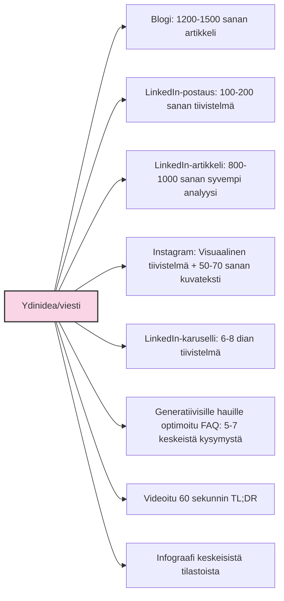
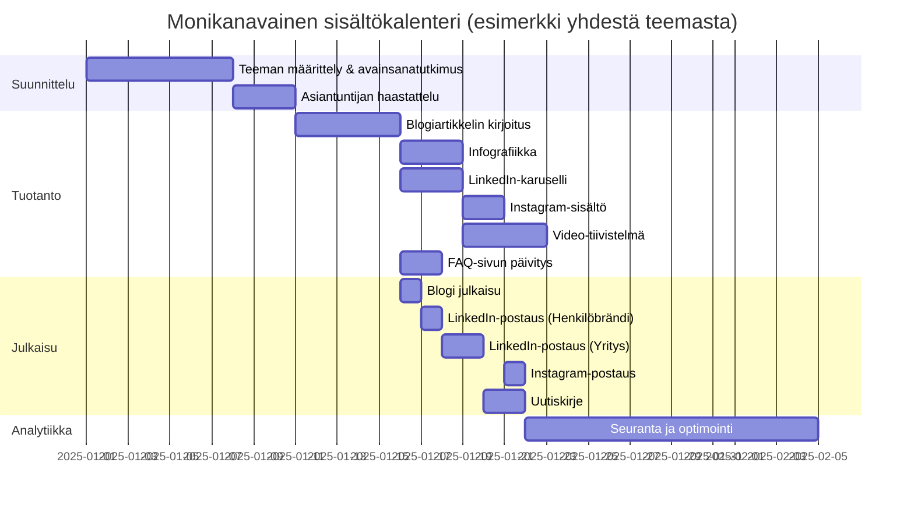

# Monikanavainen sisältöstrategia

B2B-ostajien tiedonhaku tapahtuu vuonna 2025 yhä useammassa kanavassa ja erilaisilla alustoilla. Tehokas sisältöstrategia edellyttää kaikkien relevanttien kanavien huomioimista ja sisällön muokkaamista kutakin kanavaa varten optimaaliseksi. Monikanavainen lähestymistapa varmistaa, että yritys tavoittaa B2B-ostajat kaikissa ostopolun vaiheissa.

## B2B-sisältöjen ekosysteemi 2025

```mermaid
graph TD
    A[B2B-sisältöstrategia] --> B[Hakukoneoptimoitu sisältö]
    A --> C[LinkedIn & asiantuntijaverkostot]
    A --> D[Visuaalinen sisältö & Instagram]
    A --> E[Generatiiviset haut / AI-optimoitu]
    A --> F[Sähköposti & uutiskirjeet]
    A --> G[Tapahtumat & webinaarit]
    
    B --> H[Blogiartikkelit]
    B --> I[Yrityksemme sisältökeskus]
    B --> J[Tuotesivut & dokumentaatio]
    
    C --> K[Henkilöbrändien sisällöt]
    C --> L[Yrityssivun julkaisut]
    C --> M[LinkedIn-ryhmät & keskustelut]
    C --> N[LinkedIn-artikkelit & uutiskirjeet]
    
    D --> O[Instagram-julkaisut]
    D --> P[Video & lyhytvideot]
    D --> Q[Infograafit & visualisoinnit]
    
    E --> R[Strukturoitu data / skeema]
    E --> S[Asiantuntijasisältö lähdemateriaaliksi]
    E --> T[Usein kysytyt kysymykset]
    
    F --> U[Personoitu markkinointiviestintä]
    F --> V[Tutkimusraportit & e-kirjat]
    
    G --> W[Live-tapahtumat]
    G --> X[Verkkoseminaarit & tallenteet]
    
    style B fill:#f9d5e5,stroke:#333,stroke-width:1px
    style C fill:#eeac99,stroke:#333,stroke-width:1px
    style D fill:#e06377,stroke:#333,stroke-width:1px
    style E fill:#c83349,stroke:#333,stroke-width:1px
    style F fill:#5b9aa0,stroke:#333,stroke-width:1px
    style G fill:#d6e1cd,stroke:#333,stroke-width:1px
```

B2B-sisältöjen ekosysteemi on vuonna 2025 monipuolisempi kuin koskaan aiemmin. Toimiva monikanavainen strategia ei ole sisältöjen sattumanvaraista levittämistä eri kanaviin, vaan harkittu kokonaisuus, jossa:

1. **Jokainen kanava palvelee tiettyä tarkoitusta** - Kanavan luonne ja käyttäjien odotukset ohjaavat sisällön muotoa ja tyyliä
2. **Sisällöt tukevat toisiaan** - Eri kanavien sisällöt muodostavat yhtenäisen kokonaisuuden ja ohjaavat käyttäjiä kanavasta toiseen
3. **Ostopolun vaiheet huomioidaan** - Eri kanavat palvelevat ostopolun eri vaiheissa olevia B2B-ostajia

## Monikanavainen strategia ostopolun vaiheiden mukaan

Tehokas monikanavainen strategia huomioi, että B2B-ostajat käyttävät eri kanavia ostopolun eri vaiheissa:

### 1. Tietoisuuden vaihe (Awareness)

B2B-ostaja tunnistaa ongelman tai haasteen, mutta ei välttämättä etsi vielä ratkaisua:

- **Hakukoneet**: Ongelmalähtöiset artikkelit, jotka vastaavat kysymyksiin "miksi" ja "mitä"
- **LinkedIn**: Ajatusjohtajuus-sisällöt, toimialatrendit, yleisemmät haasteet
- **Instagram & visuaaliset alustat**: Yleisemmät infograafit ja tietoiskut toimialahaasteista
- **Generatiiviset haut**: Ongelmien määrittelyyn ja ymmärtämiseen liittyvät sisällöt
- **Sähköposti & uutiskirjeet**: Toimialaraporttien tiivistelmät, trendit, uudet haasteet

### 2. Harkintavaihe (Consideration)

B2B-ostaja etsii aktiivisesti ratkaisuvaihtoehtoja tunnistettuun ongelmaan:

- **Hakukoneet**: Vertailuartikkelit, oppaat, "miten" -tyyppiset sisällöt
- **LinkedIn**: Konkreettiset neuvot, tapaustutkimukset, asiantuntijavideot
- **Instagram & visuaaliset alustat**: Tuote-/palveluesittelyt, prosessikuvaukset
- **Generatiiviset haut**: Ratkaisuvaihtoehtojen vertailu, teknologian toimintaperiaatteet
- **Sähköposti & uutiskirjeet**: Syvällisemmät oppaat ja e-kirjat, webinaarikutsut
- **Tapahtumat**: Koulutukselliset webinaarit, asiantuntijapaneelit

### 3. Päätösvaihe (Decision)

B2B-ostaja tekee lopullista valintaa ratkaisuvaihtoehtojen välillä:

- **Hakukoneet**: Tuotevertailut, asiakaskokemukset, tekniset yksityiskohdat
- **LinkedIn**: Asiakastarinat, tuote-/palveludemot, asiantuntijoiden Q&A-sessiot
- **Instagram & visuaaliset alustat**: Asiakasreferenssit, käyttökokemukset
- **Generatiiviset haut**: Tarkat tekniset tiedot, integraatiot, hinnoittelurakenteet
- **Sähköposti & uutiskirjeet**: Räätälöidyt tarjoukset, case-esimerkit
- **Tapahtumat**: Tuotedemonstraatiot, henkilökohtaiset konsultaatiot

### 4. Jälkimarkkinointi (Post-Purchase)

B2B-asiakkaan tukeminen, lisäarvon tuottaminen ja jatkokehitys:

- **Hakukoneet**: FAQ-sivut, ohjeet, troubleshooting
- **LinkedIn**: Käyttövinkit, yhteisöryhmät, jatkokehitys
- **Instagram & visuaaliset alustat**: Käyttövinkit, "tiesitkö tämän ominaisuuden" -sisällöt
- **Generatiiviset haut**: Yksityiskohtaiset tekniset ohjeet, integraatio-oppaat
- **Sähköposti & uutiskirjeet**: Tukitiedotteet, päivitykset, koulutukset
- **Tapahtumat**: Käyttäjäryhmät, koulutukset, kehittäjäyhteisö

## Sisällön muokkaaminen eri kanaviin

Tehokas monikanavainen strategia ei tarkoita saman sisällön kopioimista sellaisenaan kaikkiin kanaviin. Sen sijaan sisältö tulee muokata kunkin kanavan erityispiirteitä ja käyttäjien odotuksia vastaavaksi:

Olennaista on, että sama ydinidea tai viesti muotoillaan kanavaan sopivaksi, mutta kaikki sisällöt tukevat toisiaan ja ohjaavat samaan suuntaan.

### Esimerkki: B2B-tutkimusraportin monikanavainen hyödyntäminen

1. **Verkkosivu/blogi**: Täysimittainen tutkimusartikkeli kaikkine yksityiskohtineen ja latauksena
2. **LinkedIn-julkaisu**: Tiivistelmä tärkeimmistä löydöksistä + linkki täyteen raporttiin
3. **LinkedIn-karuselli**: 8-10 dian yhteenveto keskeisistä löydöksistä visualisoituna
4. **LinkedIn-artikkeli**: Toimialajohtajan analyysi tuloksista ja niiden merkityksestä
5. **Instagram**: Kaksi visuaalista infograafia kiinnostavimmista statistiikoista
6. **Video**: 90 sekunnin tiivistelmä keskeisistä löydöksistä
7. **Uutiskirje**: Sähköpostiyhteenveto + linkki täyteen raporttiin
8. **Webinaaritallenne**: Tulosten syvempi purku asiantuntijoiden keskustelussa
9. **FAQ-sivu**: Generatiivisille hauille optimoidut vastaukset yleisimpiin kysymyksiin
10. **Podcastjakso**: Keskustelu tutkimuksen tuloksista ja vaikutuksista toimialaan

## Sisältöjen yhdenmukaisuus brändille

Vaikka sisältöjä muokataan kanavien mukaan, on tärkeää ylläpitää brändin yhdenmukaisuutta kaikissa kanavissa. Vuonna 2025 tähän kuuluu:

1. **Visuaalinen yhdenmukaisuus** - Värit, fontit, graafinen tyyli ja elementit pysyvät yhtenäisinä
2. **Äänensävy (tone of voice)** - Viestinnän sävy pysyy yhdenmukaisena, vaikka se mukautuukin hieman kanavan mukaan
3. **Termistö ja sanasto** - Yhtenäinen termistö ja käsitteiden käyttö kaikissa kanavissa
4. **Arvolupaukset** - Keskeisten arvolupauksien johdonmukainen viestiminen

## Kanavakohtaiset tavoitteet ja mittarit

Monikanavaisessa strategiassa jokaisella kanavalla on omat tavoitteensa ja mittarinsa:

| Kanava | Ensisijaiset tavoitteet | Keskeiset mittarit |
|--------|-------------------------|-------------------|
| Verkkosivut & blogi | Orgaaninen liikenne, konversiot | Kävijämäärät, bounce rate, konversiot, sivulla vietetty aika |
| LinkedIn | Sitoutuminen, asiantuntijuus, liikenne | Impressiot, sitoutumisaste, klikit, jaot, uudet seuraajat |
| Instagram & visuaaliset | Brändin rakentaminen, työntekijäkokemus | Sitoutumisaste, kommentit, tavoitetut profiilit, seuraajien kasvu |
| Generatiiviset haut | Näkyvyys AI-vastauksissa | Maininnat AI-vastauksissa, liikenne generatiivisista hauista |
| Sähköposti & uutiskirjeet | Liidien nurture, asiakkuuksien kehitys | Avausprosentti, klikkausaste, konversiot, unsubscribe-määrä |
| Tapahtumat & webinaarit | Henkilökohtaiset kohtaamiset, demot | Osallistujamäärät, Q&A-aktiivisuus, jälkikäteiskatselut, konversiot |

## Sisältökalenteri ja resurssien allokointi

Tehokas monikanavainen strategia vaatii selkeää suunnittelua ja resurssien tehokasta allokointia. Vuonna 2025 B2B-markkinoijien sisältökalenterit ovat kehittyneet huomioimaan:

1. **Prioriteetit kanavien välillä** - Miten resurssit jakautuvat kanavien kesken?
2. **Siiloutumisen estäminen** - Miten varmistetaan saumaton yhteistyö eri kanavia hallinnoivien tiimien välillä?
3. **Uudelleenkäytön suunnittelu** - Miten sisältöjä jalostetaan tehokkaasti kanavasta toiseen?
4. **Julkaisutahti** - Mikä on optimaalinen julkaisutahti kussakin kanavassa?

## Sisältötyyppien tehokas hyödyntäminen

Monikanavainen strategia hyödyntää erilaisia sisältötyyppejä, jotka palvelevat eri tarkoituksia:

### 1. Thought Leadership -sisällöt

Ajatusjohtajuussisällöt, jotka näyttävät yrityksesi vision ja näkemyksen toimialan tulevaisuudesta:
- **Ensisijaiset kanavat**: LinkedIn-artikkelit, blogit, asiantuntijapaneelit, videohaastattelut
- **Toimivimmat muodot**: Tulevaisuuskatsaukset, trendiraportit, visionääriset artikkelit
- **Kuka tuottaa**: Yrityksen johto, tunnistetut asiantuntijat

### 2. Koulutukselliset sisällöt

Sisällöt, jotka auttavat B2B-ostajia ymmärtämään toimialan haasteita tai teknologiaa syvemmin:
- **Ensisijaiset kanavat**: Blogit, webinaarit, video-oppaat, e-kirjat, LinkedIn-artikkelit
- **Toimivimmat muodot**: Step-by-step oppaat, "kuinka" -artikkelit, selittävät videot
- **Kuka tuottaa**: Tekniset asiantuntijat, konsultit, tuotepäälliköt

### 3. Sosiaalisen todisteen sisällöt

Sisällöt, jotka näyttävät miten muut asiakkaat ovat hyötyneet ratkaisuistanne:
- **Ensisijaiset kanavat**: Asiakastarinat verkkosivuilla, video-testimonialit, Instagram-onnistumistarinat
- **Toimivimmat muodot**: Tapaustutkimukset, videoidut asiakashaastattelut, tulostilastot
- **Kuka tuottaa**: Asiakasvastaavat, markkinointi yhteistyössä asiakkaiden kanssa

### 4. Tekninen ja tuotekeskeinen sisältö

Sisällöt, jotka käsittelevät tuotteiden ja palveluiden teknisiä yksityiskohtia:
- **Ensisijaiset kanavat**: Tuotesivut, dokumentaatio, tekniset artikkelit, webinaarit
- **Toimivimmat muodot**: Tekniset spesifikaatiot, vertailutaulukot, implementaatio-oppaat
- **Kuka tuottaa**: Tuotekehitys, tuotepäälliköt, tekniset asiantuntijat

### 5. Kulttuurisisällöt

Sisällöt, jotka kertovat yrityksesi kulttuurista, arvoista ja ihmisistä:
- **Ensisijaiset kanavat**: Instagram, LinkedIn, rekrytointisivut
- **Toimivimmat muodot**: Työntekijätarinat, toimistokuvat, tapahtumakatsaukset
- **Kuka tuottaa**: HR, työntekijät, markkinointi

## Tekoälyn rooli monikanavaisessa sisältömarkkinoinnissa

Tekoäly on vuonna 2025 olennainen osa monikanavaista sisältömarkkinointia, ja sitä hyödynnetään seuraavissa rooleissa:

1. **Sisällön tuotanto ja muokkaus** - Tekoäly auttaa muokkaamaan sisältöjä eri kanaviin sopiviksi ja nopeuttaa tuotantoa
2. **Personointi** - Tekoäly auttaa räätälöimään sisältöjä eri kohderyhmille ja ostopolun vaiheisiin
3. **Optimointi** - Tekoäly analysoi suoriutumista ja ehdottaa parannuksia
4. **Monitorointi** - Tekoäly seuraa monikanavaista läsnäoloa ja auttaa tunnistamaan puutteita

B2B-markkinoinnissa tekoälyn rooli nähdään 2025 nimenomaan ihmisasiantuntijoiden työn tukena, ei korvaajana. Aitojen asiantuntijoiden näkemykset ovat edelleen sisältöjen ydin, mutta tekoäly auttaa skaalaamaan ja tehostamaan prosesseja.

## Monikanavainen sisältöstrategia suomalaisille B2B-yrityksille

Suomalaisille B2B-yrityksille monikanavainen strategia tarjoaa erityisiä mahdollisuuksia:

1. **Kansainvälistyminen** - Monikanavainen läsnäolo englanniksi laajentaa maantieteellistä tavoittavuutta
2. **Lokalisointi** - Mahdollisuus palvella sekä kotimaisilla että kansainvälisillä markkinoilla eri kielillä
3. **Erikoistuminen** - Suomalaiset B2B-yritykset voivat erottautua monikanavaisesti erityisosaamisellaan, kuten cleantech, ICT tai teollisuusratkaisut
4. **Asiantuntijuuden korostaminen** - Monikanavainen strategia mahdollistaa suomalaisen insinööriosaamisen ja luotettavuuden korostamisen

## Tulevaisuuden näkymät monikanavaisessa sisältömarkkinoinnissa

Monikanavainen sisältömarkkinointi B2B-sektorilla kehittyy jatkuvasti. Tulevat trendit, joihin markkinoijien kannattaa varautua:

1. **Immersiiviset kokemukset** - VR/AR/XR-sisällöt, jotka mahdollistavat tuotteiden virtuaalisen kokeilemisen
2. **Reaaliaikainen personointi** - Sisältöjen automaattinen räätälöinti käyttäjän profiilin ja käyttäytymisen mukaan
3. **Äänimarkkinointi** - Sisältöjen optimointi ääniassistenteille ja podcast-muodon yleistyminen
4. **Yhteisövetoinen markkinointi** - Asiakasyhteisöjen valjastaminen sisällöntuotantoon
5. **Hyperpersonointi** - Tekoälyn mahdollistama erittäin tarkka räätälöinti yksilötasolla

## Yhteenveto: Monikanavaisen strategian kehittäminen

Monikanavaisen B2B-sisältöstrategian kehittäminen vuonna 2025 edellyttää:

1. **Kohderyhmäymmärrystä** - Tietoa siitä, mitä kanavia B2B-ostajat käyttävät missäkin ostopolun vaiheessa
2. **Kanavakohtaista erikoistumista** - Kunkin kanavan erityispiirteiden ymmärtämistä ja sisältöjen optimointia
3. **Yhtenäistä brändikokemusta** - Johdonmukaista viestintää kanavasta riippumatta
4. **Mittaamista ja optimointia** - Jatkuvaa analytiikkapohjaista kehittämistä
5. **Resurssitehokkuutta** - Sisältöjen järkevää jalostamista muodosta toiseen

Onnistunut monikanavainen sisältöstrategia yhdistää oikeat sisällöt, oikeissa muodoissa, oikeissa kanavissa, oikeaan aikaan kohdeyleisölle. Se varmistaa, että B2B-yritys tavoittaa potentiaaliset asiakkaat riippumatta siitä, mitä kanavia he käyttävät tiedonhakuprosessissaan.

[← Edellinen osio: Generatiiviset hakukokemukset ja tekoäly](generatiiviset-hakukokemukset.md) | [→ Seuraava osio: Käytännön vinkit ja toimenpiteet](kaytannon-vinkit.md)