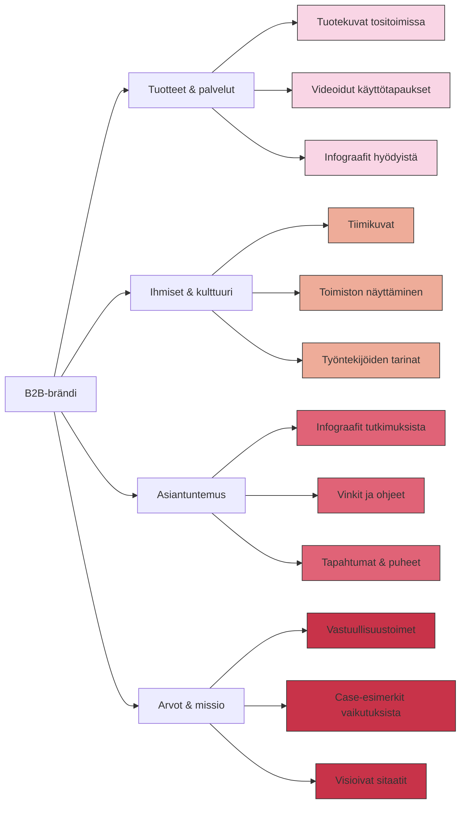

# Visuaaliset alustat (Instagram ja muut)

Visuaaliset alustat kuten Instagram, Pinterest ja muut kuva- ja videopainotteiset sosiaalisen median kanavat ovat vuonna 2025 yhä merkittävämpiä myös B2B-markkinoinnissa. Vaikka niitä on perinteisesti pidetty kuluttajabrändien kanavina, ovat monet B2B-yritykset löytäneet niistä tehokkaita väyliä brändin rakentamiseen, yrityskulttuurin esiintuomiseen ja jopa liidien generointiin.

## Instagram B2B-markkinoinnin kanavana 2025

Instagram on jatkanut kasvuaan ja vuonna 2025 sillä on jo yli 1,5 miljardia käyttäjää maailmanlaajuisesti. Merkittävä havainto B2B-markkinoijille on se, että alustan käyttäjäkunta on aikuistunut ja monipuolistunut:

- Suurin kasvava käyttäjäryhmä on 35-55-vuotiaat ammattilaiset
- B2B-päättäjistä jopa 73% käyttää Instagramia ainakin viikoittain
- Yli 85% käyttäjistä seuraa vähintään yhtä brändiä

Yllättävää kyllä, B2B-yleisöt sitoutuvat Instagramissa sisältöihin huomattavasti vahvemmin kuin monissa muissa kanavissa. Tuoreimman tutkimuksen mukaan Instagram-sisältöjen sitoutumisaste (engagement rate) on B2B-brändeillä keskimäärin 0,6%, mikä on noin kolminkertainen LinkedIniin verrattuna.

## Visuaalinen brändiviestintä B2B-sektorilla

B2B-markkinoijat ovat oppineet, että visuaalisilla alustoilla menestyy parhaiten sisältö, joka on samaan aikaan ammattimaista mutta myös inhimillistä. Vuonna 2025 toimivimpia sisältöteemoja ovat:

### 1. Tuotteet ja ratkaisut kontekstissa

B2B-ostajat haluavat nähdä ratkaisut oikeissa käyttöympäristöissä:
- Tuotteet käytössä asiakkaiden luona
- Videot, jotka näyttävät miten järjestelmät toimivat käytännössä
- Vertailevat "ennen ja jälkeen" -kuvat, jotka havainnollistavat muutosta
- Tuotteiden "behind the scenes" -materiaalit, jotka näyttävät kehitysprosessia

### 2. Ihmiset brändin takana

B2B-ostajat ostavat yhä enemmän ihmisiltä, eivät yrityksiltä:
- Autenttisia kuvia tiimistä ja asiantuntijoista
- Työntekijöiden tarinat omilla kasvoilla ja nimellä
- Työkulttuurin esittely toimistolla tai etätyössä
- Johdon ajatukset ja visiot rennoissa ympäristöissä

### 3. Asiantuntijuuden visualisointi

Visuaaliset tavat osoittaa asiantuntijuutta:
- Infograafit, jotka tiivistävät tutkimustuloksia
- Prosessikaaviot, jotka selittävät monimutkaisia konsepteja
- Lyhyet videot, joissa asiantuntijat antavat konkreettisia vinkkejä
- "Tiesitkö tämän?" -tyyppiset alaan liittyvät faktasisällöt

### 4. Arvojen ja mission visualisointi

Arvopohjainen ostaminen on lisääntynyt myös B2B-sektorilla:
- Vastuullisuustoimien dokumentointi
- Asiakkaiden ja yhteiskunnan hyötymisen näyttäminen
- "Kulissien takana" -kuvat, jotka osoittavat arvojen toteutumisen käytännössä
- Tunnustukset, palkinnot ja sertifikaatit visuaalisesti esitettyinä

## Instagram-sisältöstrategian keskeiset elementit 2025

Toimivan Instagram-strategian kehittäminen B2B-yritykselle vuonna 2025 sisältää seuraavat elementit:

### 1. Visuaalinen identiteetti

B2B-yrityksen Instagram-ilmeen tulee olla tunnistettava ja ammattimainen:
- Yhtenäinen värimaailma, joka vastaa brändin ilmettä
- Tunnistettava tyyli kuvissa (esim. filtterit, kompositio)
- Selkeä, helppolukuinen typografia infopostauksissa
- Brändin elementtien (logo, kuvakkeet) johdonmukainen käyttö

### 2. Sisältökalenteri ja julkaisuformaatit

Sisältökalenteri auttaa ylläpitämään johdonmukaista läsnäoloa:
- 2-4 feed-postausta viikossa
- Päivittäinen läsnäolo Instagram Stories -tarinoissa
- Säännölliset Instagram Reels -videot (1-2 viikossa)
- Kuukausittaiset teemat, jotka tukevat liiketoiminnan tavoitteita

### 3. Hashtagit ja löydettävyys

Hashtagit ovat edelleen tärkeitä Instagramin hakutoiminnossa. B2B-yrityksille toimivia ovat:
- Toimialakohtaiset hashtagit (esim. #teollisuusautomaatio, #kyberturvallisuus)
- Ongelmalähtöiset hashtagit (esim. #toimitusketjunhallinta, #etätyöratkaisut)
- Paikalliset hashtagit, jos yritys toimii tietyllä maantieteellisellä alueella
- Yrityksesi oma, uniikki hashtag (esim. #YritysXInsights)

Optimaalinen määrä hashtageja vuonna 2025 on 5-7 per postaus.

### 4. Sitoutumisen kasvattaminen

Instagram palkitsee sisältöjä, jotka saavat aikaan aitoa sitoutumista:
- Kysy kysymyksiä kuvateksteissä
- Käytä Instagram Stories -tarinoiden kyselyitä ja äänestyksiä
- Vastaa aina kommentteihin, mielellään 24 tunnin sisällä
- Järjestä säännöllisiä Q&A-sessioita aiheista, joissa yrityksesi on asiantuntija

### 5. Konversiostrategia

Vaikka Instagram on ensisijaisesti brändinrakennuskanava, se voi tuottaa myös liidejä:
- Hyödynnä "Link in Bio" -mahdollisuus strategisesti ja päivitä sitä kampanjoiden mukaan
- Käytä tarinoiden "Swipe Up" -toimintoa (nykyisin laajemmin saatavilla) ohjaamaan liikennettä
- Luo tarkennettuja laskeutumissivuja Instagram-kävijöitä varten
- Tarjoa eksklusiivista sisältöä Instagram-seuraajille (esim. oppaita, tutkimuksia)

## Muut visuaaliset alustat B2B-markkinoinnissa

Instagram ei ole ainoa visuaalinen alusta, jota B2B-markkinoijat hyödyntävät vuonna 2025. Muita merkittäviä alustoja ovat:

### Pinterest

Pinterest on vahvistanut asemaansa B2B-ostajien inspiraation lähteenä erityisesti:
- Suunnittelupalveluissa ja arkkitehtuurissa
- Koulutus- ja HR-sektorilla
- Graafisessa suunnittelussa ja markkinointipalveluissa

B2B-yritykset käyttävät Pinterestiä "idea board" -tyyppisesti jakaakseen inspiraatiota, oppaita ja vinkkejä.

### TikTok

Yllättäen TikTok on noussut myös B2B-markkinoinnin kanavaksi vuoteen 2025 mennessä. Siellä menestyy:
- Lyhyet "hacks" ja vinkit, jotka liittyvät työhön ja tehokkuuteen
- Humoristiset katsaukset toimialan haasteisiin
- Yrityskulttuurin esittely rennommalla otteella
- Nopeat "Ennen/jälkeen" -demonstraatiot tuotteista

Tärkeintä on ymmärtää TikTokin formaattiin sopiva esitystapa: ytimekäs, nopea ja viihdyttävä.

### YouTube Shorts ja muut lyhytvideot

Lyhytvideoformaatti on levinnyt useille alustoille, ja B2B-markkinoijat ovat löytäneet tästä tehokkaan tavan jakaa tietoa:
- 30-60 sekunnin "tietoiskut" asiantuntijoilta
- Tuotedemonstraatiot nopeutettuna
- Eniten kysyttyihin kysymyksiin vastaaminen lyhytvideoilla
- Asiakastarinat tiivistetyssä muodossa

## Suomalainen näkökulma visuaalisiin alustoihin

Suomalaisille B2B-yrityksille visuaaliset alustat tarjoavat erityisiä mahdollisuuksia:

1. **Erottautuminen** - Suomalaiset B2B-yritykset eivät vielä hyödynnä visuaalisia alustoja yhtä aktiivisesti kuin monissa muissa maissa, joten erottautuminen on helpompaa.

2. **Suomalainen design ja estetiikka** - Suomalainen minimalistinen design-perinne sopii erinomaisesti Instagramin ja muiden visuaalisten alustojen estetiikkaan.

3. **Kaksikielisyys toimii** - Visuaalisilla alustoilla toimii hyvin kaksikielinen strategia: kuva voi olla universaali, ja sen alla voi olla sekä suomen- että englanninkielinen kuvateksti.

4. **Paikallisuuden korostaminen** - Suomalaisuus ja pohjoismaisuus kannattaa tuoda esiin, sillä ne mielletään usein laadukkuuden ja luotettavuuden symboleiksi.

## Yhteenveto: Visuaalisten alustojen rooli B2B-markkinoinnissa

Visuaaliset alustat kuten Instagram ovat vuonna 2025 olennainen osa B2B-yrityksen markkinointimixiä. Niiden ensisijainen rooli on:

1. **Brändin rakentaminen** - Vahvistaa asiantuntijuutta ja luoda brändimielikuvaa visuaalisin keinoin.

2. **Yrityskulttuurin esiintuominen** - Näyttää ihmiset liiketoiminnan takana ja rakentaa luottamusta.

3. **Tuotteiden ja palveluiden havainnollistaminen** - Auttaa visualisoimaan, miten yrityksen ratkaisut toimivat käytännössä.

4. **Tiedon jakaminen** - Infograafit ja lyhytvideot tekevät monimutkaisista konsepteista helpommin ymmärrettäviä.

B2B-markkinoijien kannattaa panostaa visuaaliseen markkinointiin erityisesti, jos tavoitteena on tavoittaa nuorempia päättäjiä, rakentaa brändiä ja luottamusta pidemmällä aikavälillä, tai selittää monimutkaisia tuotteita ja palveluita yksinkertaisemmin.

[← Edellinen osio: LinkedIn ja ammatilliset verkostot](linkedin.md) | [→ Seuraava osio: Generatiiviset hakukokemukset ja tekoäly](generatiiviset-hakukokemukset.md)