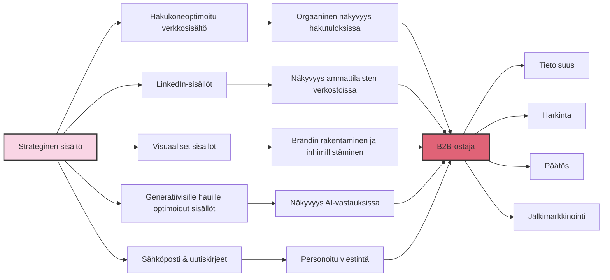

# Yhteenveto

Sisältöjen löydettävyys digitaalisilla alustoilla on vuonna 2025 B2B-markkinoinnin kriittinen menestystekijä. Tässä raportissa olemme käsitelleet neljää keskeistä alustaa: hakukoneita, LinkedIniä, visuaalisia alustoja kuten Instagramia sekä uusia generatiivisia hakukokemuksia. Kokosimme yhteen merkittävimmät trendit, strategiat ja käytännön toimenpiteet, joilla B2B-yritykset voivat varmistaa sisältöjensä näkyvyyden ja löydettävyyden.

## Keskeiset trendit 2025

Tärkeimmät trendit, jotka ohjaavat B2B-sisältöjen löydettävyyttä vuonna 2025:

1. **Asiantuntijuuden korostuminen** - Algoritmit osaavat tunnistaa ja arvottaa todellista asiantuntemusta; pinnallinen ja geneerinen sisältö ei enää riitä. E-E-A-T-kriteerit (Experience, Expertise, Authoritativeness, Trustworthiness) ohjaavat sekä hakukoneiden että sosiaalisen median algoritmeja.

2. **Tekoälyn kaksoisrooli** - Tekoäly toimii sekä työkaluna sisällöntuotannossa että hakukanavana. B2B-markkinoijien tulee ymmärtää sekä tekoälyn mahdollisuudet tuotannossa että sen toiminta hakukokemuksissa.

3. **Visuaalisuuden kasvu** - Visuaaliset elementit, erityisesti videot, infograafit ja dokumenttikarusellit ovat nousseet entistä tärkeämmiksi myös B2B-kontekstissa.

4. **Henkilöbrändien merkitys** - Yritysbrändin rinnalla korostuvat henkilöbrändien merkitys. Erityisesti johdon ja asiantuntijoiden aktiivisuus digitaalisissa kanavissa rakentaa luottamusta ja laajentaa tavoittavuutta.

5. **Niche-yhteisöjen voima** - Laajojen yleisöjen tavoittelun sijaan fokus kohdennettuihin asiantuntijayhteisöihin, joissa sitoutuminen ja keskustelujen laatu ovat korkeampia.

```mermaid
graph TD
    A[B2B-markkinoinnin<br>digitaaliset trendit 2025] --> B[Asiantuntijuuden korostuminen]
    A --> C[Tekoälyn kaksoisrooli]
    A --> D[Visuaalisuuden kasvu]
    A --> E[Henkilöbrändien merkitys]
    A --> F[Niche-yhteisöjen voima]
    
    B --> B1[E-E-A-T-kriteerit]
    B --> B2[Syvällinen osaaminen]
    B --> B3[Kokemukseen perustuva sisältö]
    
    C --> C1[AI sisällöntuotannon työkaluna]
    C --> C2[AI hakukanavana]
    C --> C3[Generatiivinen optimointi]
    
    D --> D1[Dokumenttikarusellit]
    D --> D2[Lyhytvideot ja Reels]
    D --> D3[Infograafit ja visualisoinnit]
    
    E --> E1[Johdon näkyvyys]
    E --> E2[Asiantuntijoiden aktivointi]
    E --> E3[Työntekijälähettilyys]
    
    F --> F1[LinkedIn-niche-ryhmät]
    F --> F2[Toimialakohtaiset yhteisöt]
    F --> F3[Asiantuntijaverkostot]
    
    style A fill:#f9d5e5,stroke:#333,stroke-width:2px
    style B fill:#f4f4f4,stroke:#333,stroke-width:1px
    style C fill:#f4f4f4,stroke:#333,stroke-width:1px
    style D fill:#f4f4f4,stroke:#333,stroke-width:1px
    style E fill:#f4f4f4,stroke:#333,stroke-width:1px
    style F fill:#f4f4f4,stroke:#333,stroke-width:1px
```

## Menestyksen avaimet eri alustoilla

### Hakukoneissa

- **Teknisesti erinomaiset sivustot** - Käyttäjäkokemus, nopeus ja mobiiliystävällisyys
- **Skeema-merkinnät ja strukturoitu data** - FAQ, Article, HowTo ja muut relevantit skeematyypit
- **Asiantuntijasisältö** - Kirjoittajaprofiilit, asiantuntemuksen osoittaminen ja kokemukseen perustuva sisältö
- **Hakijalähtöinen sisältö** - Aitoihin kysymyksiin vastaaminen monipuolisilla formaateilla

### LinkedInissä

- **Henkilöbrändien ja yritysbrändin symbioosi** - Johdon ja asiantuntijoiden aktivointi
- **Monipuoliset sisältömuodot** - Erityisesti karusellipostaukset, artikkelit ja videot
- **Niche-yhteisöjen hyödyntäminen** - Kohdennettu läsnäolo relevanteissa ammattiryhmissä
- **Algoritmiymmärrys** - LinkedInin algoritmi suosii asiantuntemusta, keskustelua ja jatkuvuutta

### Visuaalisilla alustoilla (Instagram)

- **Brändin inhimillistäminen** - Kulissien takana, ihmiset ja yrityskulttuuri
- **Asiantuntemuksen visualisointi** - Infograafit, prosessikuvaukset ja tietoiskut
- **Hashtagien strateginen käyttö** - 5-7 tarkasti kohdennettua hashtagia
- **Tuotteet ja palvelut kontekstissa** - Ratkaisut käytössä oikeissa ympäristöissä

### Generatiivisissa hakukoneissa

- **Selkeästi strukturoitu sisältö** - Kysymys-vastausmuoto, hierarkkinen rakenne
- **Asiantuntijuuden signaalit** - Lähdeviittaukset, asiantuntijaprofiilien korostaminen
- **Faktapohjaisuus ja data** - Tilastot, tarkat määritelmät ja ajankohtaiset tiedot
- **Semanttinen rikkaus** - Käsitteiden väliset suhteet, konteksti ja termien selitykset

## Monikanavaisen strategian keskeiset elementit

Tehokas monikanavainen B2B-sisältöstrategia 2025 sisältää:

1. **Yhdenmukaisuus brändiviestissä** - Johdonmukainen äänensävy ja visuaalinen ilme kanavasta riippumatta

2. **Kanavakohtainen optimointi** - Sisältöjen muokkaaminen kunkin kanavan erityispiirteiden mukaan

3. **Ostopolun vaiheiden huomioiminen** - Eri kanavat palvelevat ostopolun eri vaiheissa olevia B2B-ostajia

4. **Sisältöjen repurpose-prosessit** - Tehokas prosessi sisältöjen muokkaamiseen eri kanaviin

5. **Mittaaminen ja jatkuva kehittäminen** - Datalähtöinen monikanavainen analytiikka

## Tulevaisuuden näkymät ja kehityssuunnat

B2B-markkinoinnin digitaalisen löydettävyyden tulevaisuus näyttää seuraavalta:

1. **Tekoälyn ja ihmisasiantuntijoiden yhteistyö** - Tekoäly auttaa sisällöntuotannossa, mutta aito asiantuntijuus korostuu

2. **Immersiiviisten kokemusten yleistyminen** - AR/VR ja muut uudet muodot täydentävät sisältökokemuksia

3. **Hyperpersonointi** - Tarkempi räätälöinti yksilöllisten tarpeiden ja ostopolun vaiheiden mukaan

4. **Moniaistillisuus** - Ääni, kuva ja vuorovaikutteisuus yhdistyvät entistä saumattomammin

5. **Yhteisökeskeisyys** - Brändiyhteisöjen merkitys kasvaa, ja käyttäjälähtöinen sisältö lisääntyy

## Toimenpiteiden priorisointi

B2B-markkinoijien kannattaa priorisoida toimenpiteet seuraavasti:

### Kiireelliset toimenpiteet (1-4 viikkoa)

1. Tekninen SEO ja sivuston optimointi
2. LinkedIn-profiilin ja -sivun optimointi
3. Asiantuntijoiden aktivointi sosiaalisessa mediassa
4. FAQ-sivujen kehittäminen ja skeema-merkinnät generatiivisia hakuja varten

### Keskipitkän aikavälin kehitys (1-3 kuukautta)

1. Sisältökalenteri ja monikanavainen strategia
2. Työntekijälähettiläsohjelman rakentaminen
3. Dokumenttikarusellien ja visuaalisten elementtien kehittäminen
4. Monikanavaisen mittaamisen työkalut

### Strateginen kehitys (3-12 kuukautta)

1. Toimialakohtaiset tutkimukset ja oman tutkimusdatan tuottaminen
2. Niche-yhteisöjen rakentaminen ja aktivointi
3. Monikanavaisen personoinnin kehittäminen
4. Tekoälyn laajempi hyödyntäminen sisällöntuotannossa

## Suomalainen näkökulma

Suomalaisille B2B-yrityksille digitaalinen löydettävyys tarjoaa erityisiä mahdollisuuksia:

1. **Kaksikielisyys etuna** - Sekä suomenkieliset että englanninkieliset sisällöt tavoittavat eri yleisöjä

2. **Suomenkielisen sisällön pienempi kilpailu** - Niche-sisällöissä helpompi saavuttaa näkyvyyttä

3. **Pohjoismaisuuden korostaminen** - Luotettavuus, innovatiivisuus ja kestävyys suomalaisina vahvuuksina

4. **Erikoistuminen teknisillä aloilla** - Mahdollisuus rakentaa globaalia asiantuntija-asemaa tietyissä niche-alueissa

## Loppusanat

B2B-sisältöjen löydettävyys digitaalisilla alustoilla vuonna 2025 on monimutkainen kokonaisuus, jossa teknologian kehitys, ihmisten käyttäytymisen muutokset ja alustojen algoritmimuutokset luovat jatkuvasti uusia haasteita ja mahdollisuuksia. Menestyvät B2B-markkinoijat ymmärtävät sekä teknisen perustan tärkeyden että aidon asiantuntemuksen arvon.

Menestyksen ytimessä on tasapaino – teknologian tehokas hyödyntäminen yhdistettynä inhimilliseen asiantuntemukseen. Alustat ja algoritmit muuttuvat, mutta perusta pysyy: tarjoa aitoa arvoa, osoita todellista asiantuntemusta, ja ole läsnä niissä kanavissa, joissa kohderyhmäsi viettää aikaa.

Toivomme, että tämä raportti auttaa B2B-markkinoijia navigoimaan digitaalisen löydettävyyden monimutkaisessa maailmassa ja rakentamaan strategioita, jotka luovat kestävää kilpailuetua vuonna 2025 ja sen jälkeen.

[← Edellinen osio: Käytännön vinkit ja toimenpiteet](kaytannon-vinkit.md) | [→ Takaisin alkuun](README.md)