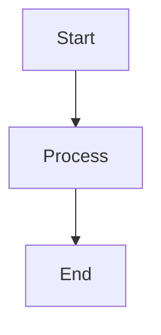

# Features

This document provides detailed information about the features available in the Markdown Viewer application.

## Core Features

### Markdown Rendering

The application uses the [Marked.js](https://marked.js.org/) library to parse and render Markdown content. It supports:

- Headers (all levels)
- Lists (ordered and unordered)
- Links and images
- Bold and italic text
- Code blocks and inline code
- Blockquotes
- Horizontal rules
- Tables

### File Management

- **Multiple File Support**: Load and manage multiple Markdown files simultaneously
- **Drag & Drop Interface**: Add files by dragging them from your file system
- **File Organization**: Reorder files by dragging them in the sidebar
- **File Removal**: Remove individual files or clear all files at once

### Viewing Options

- **Single File View**: Focus on one file at a time
- **All Files View**: See all files in a continuous scroll
- **Alphabetical Sorting**: Sort files alphabetically with one click

### Editing Capabilities

- **Integrated Editor**: Edit Markdown files directly in the browser
- **Syntax Highlighting**: Color-coded editor for easier editing
- **Line Numbers**: Visual reference for locating content
- **Word Wrapping**: Comfortable editing experience without horizontal scrolling

### Data Persistence

- **Local Storage**: Files and settings are saved to browser local storage
- **Session Persistence**: Return to your files exactly as you left them
- **Export Functionality**: Save files back to your computer when needed

## Advanced Features

### Mermaid Diagram Support

The application integrates [Mermaid](https://mermaid.js.org/) to render diagrams and charts directly from your Markdown. Supported diagram types include:

- Flowcharts
- Sequence diagrams
- Class diagrams
- State diagrams
- Entity Relationship diagrams
- User Journey diagrams
- Gantt charts
- Pie charts

To create a Mermaid diagram, use the following syntax in your Markdown:

```

```

### Responsive Design

The application is designed to work well on various screen sizes:

- **Desktop**: Full-featured experience with sidebar and content area
- **Tablet**: Adapted layout for medium-sized screens
- **Mobile**: Optimized for smaller screens with collapsible elements

### Theme Support

The application includes a clean, readable theme for both the content display and editor:

- **Content Theme**: Optimized for readability with proper spacing and typography
- **Editor Theme**: Material design theme for comfortable editing
- **Code Highlighting**: Syntax highlighting for code blocks

## Technical Features

### No Server Dependency

The application runs entirely in the browser without requiring a server component, making it:

- Easy to deploy
- Portable
- Private (no data is sent to any server)

### Performance Optimization

- **Efficient Rendering**: Only re-renders content when necessary
- **Lazy Loading**: Mermaid diagrams are rendered on demand
- **Memory Management**: Efficient handling of multiple files

### Browser Compatibility

The application is designed to work with modern browsers:

- Chrome
- Firefox
- Safari
- Edge
