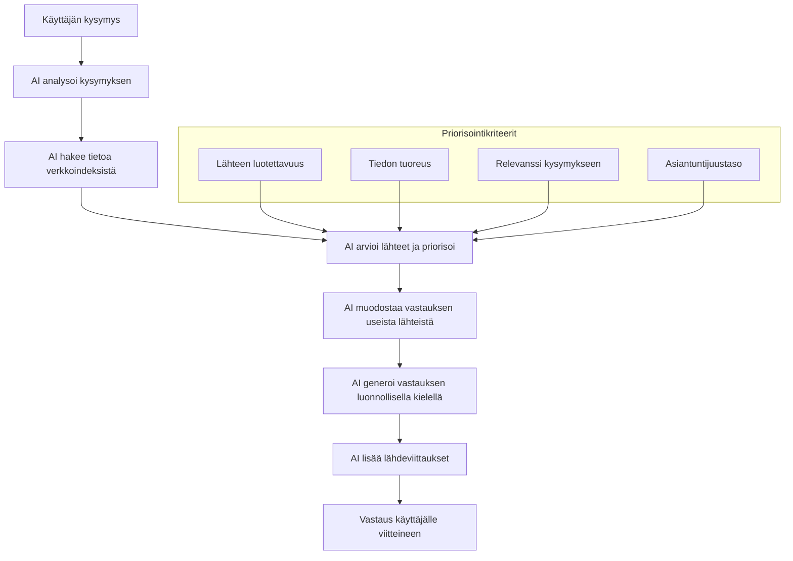

# Generatiiviset hakukokemukset ja tekoäly

Generatiiviset tekoälypohjaiset hakukokemukset ovat muuttaneet merkittävästi tiedonhakua ja -kulutusta vuoteen 2025 mennessä. B2B-ostajat hyödyntävät yhä enemmän tekoälypohjaisia hakukoneita, jotka tarjoavat suoria vastauksia pitkien hakutuloslistojen sijaan. Tämä kehitys on luonut uusia haasteita ja mahdollisuuksia B2B-sisältöjen löydettävyydelle.

## Generatiivisten hakukoneiden kehitys 2025

Vuonna 2025 hakukokemus on merkittävästi erilainen kuin muutama vuosi sitten. Yleisimmät tekoälypohjaiset hakualustat ovat:

1. **Google AI Overviews** - Googlen perinteisiin hakutuloksiin integroitu tekoälypohjainen yhteenveto, joka koostaa vastauksen useista lähteistä ja näyttää viitteet lähdeverkkosivuihin.

2. **Microsoft Copilot** - Bingin hakukoneeseen ja Microsoft-ekosysteemiin (Windows, Edge, Office) integroitu tekoälyavustaja, joka hakee tietoa verkosta ja muodostaa siitä kokonaisvaltaisia vastauksia.

3. **Perplexity AI** - Erikoistunut tekoälyhakukone, joka on vuoteen 2025 mennessä vakiinnuttanut asemansa erityisesti asiantuntijoiden ja B2B-päättäjien keskuudessa tarkkoine vastauksineen ja selkeine lähdeviittauksineen.

4. **ChatGPT Browse** - OpenAI:n chatbot, joka pystyy hakemaan reaaliaikaista tietoa verkosta ja muodostamaan vastauksia kysymyksiin.

5. **Claude Search** - Anthropicin kehittämä hakutoiminto, joka on erikoistunut monimutkaisiin tutkimuskysymyksiin ja painottaa erityisesti lähteiden luotettavuutta.

B2B-kontekstissa merkittävä muutos on se, että jopa 60% tiedonhausta tapahtuu vuonna 2025 generatiivisten hakukoneiden kautta, erityisesti monimutkaisemmissa kysymyksissä, joihin perinteiset hakukoneet eivät anna suoraa vastausta.

## Miten generatiiviset hakukoneet toimivat

Generatiiviset hakukoneet eroavat perinteisistä hakukoneista seuraavilla tavoilla:

1. **Suora vastaus vs. linkit** - Perinteinen hakukone antaa listan linkkejä, generatiivinen hakukone antaa suoran vastauksen ja viittaa lähteisiin.

2. **Tiedon syntetisointi** - Generatiivinen hakukone yhdistää tietoa useista lähteistä yhteen koherenttiin vastaukseen.

3. **Kontekstuaalinen ymmärrys** - Tekoäly ymmärtää paremmin kysyjän aikomuksen ja voi käydä keskustelua, tarkentaa kysymyksiä jne.

4. **Asiantuntijuuden painotus** - Modernit generatiiviset hakukoneet pyrkivät tunnistamaan ja priorisoimaan asiantuntijasisältöjä.

Vuonna 2025 generatiiviset hakukoneet ovat kehittyneet tunnistamaan erityisen hyvin:

- **Sisällön luotettavuuden** - Algoritmit arvioivat lähteen mainetta, asiantuntijuutta ja aikaisempaa täsmällisyyttä
- **Sisällön ajantasaisuuden** - Painoarvo tuoreille lähteille, erityisesti nopeasti muuttuvissa aiheissa
- **Asiantuntijuuden syvyyden** - Asiantuntijasisältö priorisoidaan geneerisen sisällön edelle

## Sisältöjen optimointi tekoälyhakuja varten (GEO)

Sisältöjen optimointi generatiivisia hakukoneita varten (Generative Engine Optimization, GEO) on noussut SEO:n rinnalle tärkeäksi B2B-markkinoinnin osa-alueeksi. Keskeiset periaatteet GEO:ssa vuonna 2025:

### 1. Asiantuntijuuden esiin tuominen

Generatiiviset hakukoneet priorisoivat lähteitä, jotka osoittavat selkeää asiantuntijuutta:

- **Tunnistettava asiantuntija** - Sisällön kirjoittaja on merkitty selkeästi, ammatillisine referensseineen ja sertifikaatteineen
- **Syvällinen analyysi** - Pinnallisen yleiskatsauksen sijaan syvempi analyysi aiheesta
- **Konkreettiset esimerkit** - Todelliseen kokemukseen perustuvat esimerkit ja tapaustutkimukset

### 2. Selkeä rakenne ja luettavuus

Tekoäly suosii sisältöä, joka on selkeästi jäsennelty:

- **Loogiset otsikkotasot** - Hierarkkinen rakenne H1, H2, H3... otsikoineen
- **Listat ja taulukot** - Tiedon esittäminen selkeästi jäsennellyssä muodossa
- **Kysymys-vastaus-rakenne** - Eksplisiittiset kysymykset ja niihin vastaaminen

### 3. Strukturoitu data ja skeema-merkinnät

Strukturoitu data auttaa AI:ta ymmärtämään sisällön merkitystä:

- **FAQ-skeema** - Mahdollistaa kysymys-vastausparien selkeän merkitsemisen
- **HowTo-skeema** - Prosessien ja ohjeiden merkitseminen
- **Asiantuntijuus-skeema** - Author, Person ja Organization -skeemat asiantuntijuuden osoittamiseksi

### 4. Lähdeviittaukset ja datan käyttö

Tekoälyhaut suosivat sisältöä, joka viittaa luotettaviin lähteisiin:

- **Selkeät viittaukset** - Tutkimuksiin, raportteihin ja arvostettuihin lähteisiin viittaaminen
- **Tilastot ja data** - Faktojen tukeminen konkreettisella datalla
- **Lähteiden monimuotoisuus** - Useiden luotettavien lähteiden käyttö monipuolisen näkökulman tarjoamiseksi

### 5. Sisällön ainutlaatuisuus ja lisäarvo

Generatiiviset hakukoneet tunnistavat yhä paremmin sisällön, joka tarjoaa ainutlaatuista näkökulmaa:

- **Alkuperäinen tutkimus** - Omat tutkimukset, kyselyt ja data nousevat arvokkaammiksi
- **Asiantuntijanäkemys** - Toimialan kehityksen tulkinta ja ennusteet
- **Konkretia geneerisyyden sijaan** - Spesifit neuvot yleisten ohjeiden sijaan

## Strategia eri generatiivisten hakukoneiden osalta

Eri generatiiviset hakukoneet painottavat hieman eri asioita, joten optimaalinen strategia huomioi näiden erot:

### Google AI Overviews

- **E-E-A-T-kriteerit** - Experience, Expertise, Authoritativeness, Trustworthiness korostuvat erityisesti
- **Hakukoneoptimoidut sivut** - Perinteinen SEO toimii pohjana AI Overviews -nostoille
- **Pitkäaikainen auktoriteetti** - Verkkosivun pitkä historia ja luotettavuus vaikuttavat vahvasti

### Microsoft Copilot

- **Microsoft-ekosysteemin integraatio** - Office-dokumentit, LinkedIn ja muut Microsoftin palvelut saavat erityisen painoarvon
- **Työhön liittyvät aiheet** - Painottaa sisältöä, joka liittyy suoraan työtehtäviin ja yrityskäyttöön
- **Visuaalisuus** - Arvostaa hyvin kuvitettua ja visualisoitua sisältöä

### Perplexity AI

- **Akateeminen ja asiantuntijasisältö** - Painottaa erityisesti asiantuntija-artikkeleita ja tieteellisiä lähteitä
- **Täsmällisyys** - Arvostaa tarkkoja määritelmiä ja teknisiä yksityiskohtia
- **Vaihtoehtojen vertailu** - Nostaa esiin sisältöjä, jotka vertailevat eri ratkaisuja objektiivisesti

### ChatGPT Browse ja Claude Search

- **Keskustelumuotoinen sisältö** - Sisältö, joka vastaa suoraan tyypillisiin asiakaskysymyksiin
- **Ajantasaisuus** - Painottaa tuoreinta tietoa erityisesti muuttuvissa aiheissa
- **Selkeys monimutkaisissa aiheissa** - Arvostaa monimutkaistenkin aiheiden selkeää esittämistä

## Sisältöjen mittaaminen ja seuranta generatiivisissa hauissa

B2B-markkinoijalle on tärkeää ymmärtää, miten sisällöt suoriutuvat generatiivisissa hauissa. Vuonna 2025 käytettäviä mittareita ovat:

1. **Viittausten seuranta** - Kuinka usein sisältösi on mainittu generatiivisten hakukoneiden vastauksissa

2. **Click-through generatiivisista vastauksista** - Kuinka moni klikkaa lähteeseesi tekoälyn vastauksen jälkeen

3. **Generoitujen vastausten laatu** - Miten hyvin tekoäly on ymmärtänyt ja välittänyt sisältösi keskeisen viestin

4. **Vastausten kattavuus** - Kuinka laajassa aihepiirissä sisältöösi viitataan

B2B-markkinoijalle on syntynyt myös uusia työkaluja, jotka seuraavat näkyvyyttä generatiivisissa hauissa, esimerkiksi erilaisia "AI-mention tracking" -työkaluja, jotka havaitsevat, kun sisältöön viitataan tekoälyn vastauksissa.

## Suomalainen näkökulma tekoälyhakuihin

Suomenkielisiä generatiivisia hakukokemuksia on tullut markkinoille vuoteen 2025 mennessä, mutta niiden kehitys on vielä jäljessä englanninkielisiin verrattuna. Tämä tarjoaa suomalaisille B2B-yrityksille sekä haasteita että mahdollisuuksia:

1. **Suomenkielinen asiantuntijasisältö** - Generatiiviset hakukoneet tarvitsevat laadukasta suomenkielistä sisältöä, ja asiantuntevien B2B-sisältöjen tuottajilla on mahdollisuus täyttää tämä aukko.

2. **Kaksikielinen strategia** - Kaksikielinen sisältö (suomi ja englanti) mahdollistaa näkyvyyden sekä kansainvälisissä että kotimaisissa generatiivisissa hauissa.

3. **Paikallinen asiantuntemus** - Suomen markkinoita, lainsäädäntöä ja liiketoimintaympäristöä koskeva asiantuntijasisältö on erityisen arvokasta, sillä sen tarjonta on rajattua.

4. **Uudet hakutottumukset** - Suomalaiset B2B-päättäjät käyttävät yhä enemmän englanninkielisiä generatiivisia hakukoneita, erityisesti teknisemmissä aiheissa.

## Eettiset ja juridiset näkökulmat

Generatiiviset hakukoneet herättävät myös kysymyksiä tekijänoikeuksista ja sisällön käytöstä:

1. **Tekijänoikeudet ja attribuutio** - Tekoäly voi käyttää sisältöä vastauksissa ilman selkeää attribuutiota.

2. **Virheelliset viittaukset** - Tekoäly saattaa joskus viitata virheellisesti sisältöön tai ymmärtää sen väärin.

3. **Generatiivisen sisällön tunnistaminen** - Hakukoneet pyrkivät tunnistamaan puhtaasti tekoälyn tuottaman sisällön erottaakseen sen aidosta asiantuntemuksesta.

B2B-markkinoijien kannattaa seurata tätä kehitystä ja varmistaa, että sisällön uudelleenkäyttö generatiivisissa hauissa on linjassa yrityksen strategian kanssa.

## Tulevaisuuden näkymät (2025 ja eteenpäin)

Generatiiviset hakukoneet jatkavat kehitystään, ja todennäköisesti näemme tulevina vuosina:

1. **Multimodaalisuuden yleistymisen** - Generatiiviset haut ymmärtävät ja käsittelevät kuvia, ääntä ja videota yhä paremmin.

2. **Personoinnin lisääntymisen** - Hakuvastaukset räätälöidään käyttäjän osaamistason, kiinnostuksen kohteiden ja kontekstin mukaan.

3. **Toimialakohtaisten erikoistuneiden hakukoneiden nousun** - Erityiset generatiiviset hakukoneet, jotka keskittyvät tiettyihin B2B-toimialoihin, kuten terveydenhuolto, rahoitus tai IT.

4. **Tekoälyn ja ihmisasiantuntijoiden yhteistyön** - Palveluita, jotka yhdistävät generatiivisen tekoälyn ihmisasiantuntijoiden osaamiseen.

B2B-markkinoijien on tärkeää pysyä näiden kehityssuuntien tasalla ja mukauttaa sisältöstrategiaansa vastaavasti.

## Yhteenveto: Generatiivisten hakukoneiden vaikutus B2B-markkinointiin

Generatiiviset hakukoneet ovat merkittävästi muuttaneet sitä, miten B2B-ostajat etsivät ja kuluttavat tietoa. Ne ovat luoneet uuden kerroksen löydettävyyden dynamiikkaan, jossa ei riitä, että sisältö löytyy hakukoneista – sen pitää myös nousta tekoälyn valitsemaksi lähteeksi.

B2B-markkinoijille tämä muutos korostaa:

1. **Aidon asiantuntijuuden merkitystä** - Pinnallinen, geneerinen sisältö ei riitä; tarvitaan syvällistä, kokemukseen perustuvaa asiantuntemusta.

2. **Sisällön rakenteen ja selkeyden tärkeyttä** - Hyvin jäsennelty, selkeä sisältö on sekä lukijaystävällistä että tekoäly-ystävällistä.

3. **Lähteiden, datan ja esimerkkien arvoa** - Faktojen tukeminen luotettavilla lähteillä ja konkreettisilla esimerkeillä vahvistaa sisällön asemaa.

4. **Uutta mittaamisen ja analytiikan tarvetta** - Ymmärrys siitä, miten sisältö menestyy generatiivisissa hauissa, on entistä tärkeämpää.

Kokonaisuudessaan generatiiviset hakukoneet edustavat uutta aikaa B2B-tiedonhaussa, mikä vaatii sisällön tuottajilta entistä strategisempaa lähestymistapaa ja vahvempaa fokusta todelliseen asiantuntijuuteen.

[← Edellinen osio: Visuaaliset alustat (Instagram ja muut)](visuaaliset-alustat.md) | [→ Seuraava osio: Monikanavainen sisältöstrategia](monikanavainen-strategia.md)