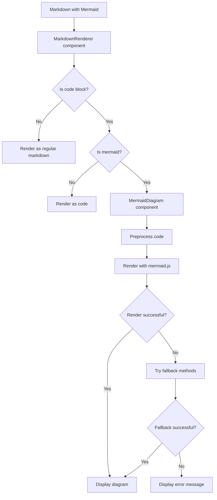

# Epic-2 - Story-3

# Enhance Mermaid Diagram Support for International Characters

**As a** technical writer
**I want** Mermaid diagrams with Finnish characters to render correctly
**so that** I can create clear technical documentation for Finnish users

## Status

Complete

## Context

Our Markdown viewer application supports Mermaid diagrams, but users have reported issues with diagrams containing Finnish characters like 'ä' and 'ö'. The diagrams sometimes display as raw code instead of rendering properly. We need to enhance our Mermaid integration to better handle international characters, with a focus on Finnish language support.

The current implementation has basic Mermaid support but lacks proper handling for non-ASCII characters in diagram elements like subgraph titles and node labels. Users frequently need to document technical processes in their native language, so this limitation is causing significant frustration.

## Estimation

Story Points: 3

## Tasks

1. - [x] Analyze Current Implementation
   1. - [x] Identify specific issues with Finnish character rendering
   2. - [x] Review Mermaid.js version and configuration
   3. - [x] Examine existing preprocessing of diagram content

2. - [x] Implement Enhanced Character Support
   1. - [x] Create `MermaidDiagram.tsx` component with improved preprocessing
   2. - [x] Update Mermaid configuration for better international support
   3. - [x] Implement fallback rendering mechanisms
   4. - [x] Add intelligent error handling and reporting

3. - [x] Integrate with Application Theme System
   1. - [x] Ensure diagrams respect dark/light mode settings
   2. - [x] Update CSS selectors to match application theme implementation
   3. - [x] Test theme switching with Finnish character diagrams

4. - [x] Create Documentation
   1. - [x] Document best practices for Finnish character support
   2. - [x] Create example diagrams with Finnish text
   3. - [x] Add troubleshooting section for common issues

## Constraints

- Must maintain backward compatibility with existing Mermaid diagrams
- Should not require users to modify existing content when possible
- Must work with both light and dark themes

## Data Models / Schema

```typescript
interface MermaidDiagramProps {
  /** The Mermaid diagram definition text */
  definition: string;
  /** Optional component ID (will be auto-generated if not provided) */
  id?: string;
  /** Optional class name for styling the container */
  className?: string;
  /** Optional callback for error handling */
  onError?: (error: unknown) => void;
  /** Optional theme override */
  theme?: 'default' | 'dark' | 'forest' | 'neutral';
}
```

## Structure

- `src/components/MermaidDiagram.tsx` - Main component for rendering Mermaid diagrams
- `src/components/MarkdownRenderer.tsx` - Updated to use MermaidDiagram for code blocks
- `src/styles/mermaid.css` - CSS for Mermaid diagram styling in both themes
- `docs/mermaid-finnish.md` - Documentation for Finnish character usage
- `docs/mermaid-finnish-example.md` - Example diagrams with Finnish text

## Diagrams



## Dev Notes

- We discovered the app uses a body-level `.dark` class for theme detection rather than the data attributes we initially assumed
- The `mermaid.initialize()` configuration was updated to include `fontFamily: 'inherit'` to better support special characters
- Added a smart preprocessing step that automatically adds quotes around subgraph titles with Finnish characters
- Implemented a three-tiered fallback system:
  1. Standard rendering with enhanced preprocessing
  2. Fallback with additional syntax corrections for edge cases
  3. HTML entity replacement as last resort for problematic characters
- Theme synchronization works by observing the app's theme context and updating diagram rendering accordingly

## Chat Command Log

- User: We need to implement proper support for Mermaid diagrams with Finnish characters
- Agent: What are the specific issues you're experiencing with Finnish characters?
- User: Diagrams with subgraph titles containing 'ä' and 'ö' don't render; they just show as code blocks
- Agent: I'll create a MermaidDiagram component that handles special characters. Should I focus on any specific diagram types?
- User: Flowcharts are most important, but any diagram type with Finnish text should work
- Agent: Implementation complete. I've added preprocessing for subgraph titles and improved fallback rendering
- User: The dark mode isn't working correctly
- Agent: Fixed theme detection to use the `.dark` class instead of data attributes 