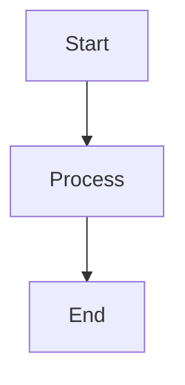

# User Guide

This comprehensive guide covers all aspects of using the Markdown Viewer application.

## Interface Overview

The Markdown Viewer interface consists of three main areas:

1. **Sidebar**: Contains the file list and control buttons
2. **Content Area**: Displays the rendered Markdown content
3. **Editor**: Appears when editing a file

### Sidebar Components

- **File List**: Shows all loaded Markdown files
- **Sort Button**: Sorts files alphabetically (A-Z)
- **View Toggle Button**: Switches between single file and all files view
- **Export Button**: Exports the current file
- **Clear All Button**: Removes all files from the application

## File Management

### Adding Files

Drag and drop Markdown (.md) files from your computer into the content area. You can add multiple files at once.

### Removing Files

To remove a single file:
1. Locate the file in the sidebar
2. Click the × button next to the file name

To remove all files:
1. Click the "Clear All" button in the sidebar
2. Confirm the deletion when prompted

### Organizing Files

You can change the order of files in the sidebar by dragging and dropping them into the desired position. This affects the display order when viewing all files.

## Viewing Content

### Single File View

By default, the application shows one file at a time. To view a specific file:
1. Click on the file name in the sidebar
2. The file's content will be displayed in the content area

### All Files View

To view all files at once:
1. Click the "View Toggle" button in the sidebar
2. All files will be displayed in the content area, one after another
3. Each file will have its name as a heading

To return to single file view, click the "View Toggle" button again.

## Editing Content

### Starting Edit Mode

1. Select a file in single file view
2. Click the "Edit" button at the top of the content area
3. The editor will appear with the file's content

### Using the Editor

The editor provides:
- Syntax highlighting for Markdown
- Line numbers
- Word wrapping

### Saving Changes

After making edits:
1. Click the "Save" button to save your changes
2. The file will be updated and the view will return to display mode

### Canceling Edits

To discard your changes:
1. Click the "Cancel" button
2. Confirm when prompted
3. The view will return to display mode without saving changes

## Exporting Content

To export the current file:
1. Make sure you're in single file view with the desired file selected
2. Click the "Export" button in the sidebar
3. The file will be downloaded to your computer with its original name

## Mermaid Diagrams

The application supports Mermaid diagrams in your Markdown files. To include a diagram:

1. Use the Mermaid syntax in your Markdown file:

2. The diagram will be rendered automatically when the file is displayed

## Persistence

The application automatically saves:
- All loaded files
- The current view mode (single or all)
- The currently selected file
- The order of files in the sidebar

This data is stored in your browser's local storage and will persist between sessions.
