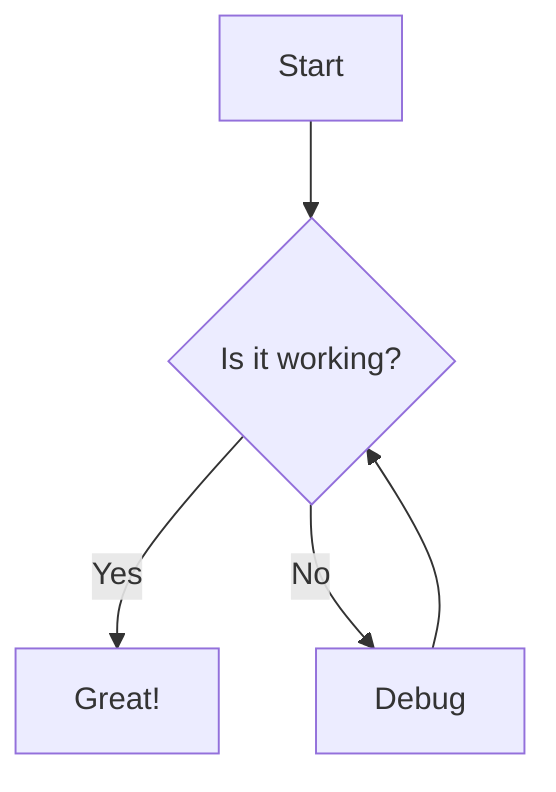

# Modern Markdown Viewer

A modern, modular Markdown viewer and editor built with React and Vite.


## Features

- 📝 View and edit Markdown files
- 🎨 Light and dark theme support
- 📊 Mermaid diagram rendering
- 📱 Responsive design for all devices
- 💾 Local storage for persistence
- 📤 Export functionality
- 🔄 Drag and drop file management
- 🌓 **Enhanced Mermaid diagram support**
- 🖼️ GitHub Flavored Markdown support (tables, task lists, etc.)
- 🔍 Syntax highlighting for code blocks
- 🧩 Modular, maintainable architecture

### Mermaid Diagram Support

Create beautiful diagrams and charts directly in your markdown with the built-in Mermaid.js integration. Simply write your diagram definition in a code block with the `mermaid` language identifier:



This will automatically render as:


MDViewer supports all diagram types available in Mermaid, including flowcharts, sequence diagrams, class diagrams, state diagrams, Gantt charts, and more. See the [Mermaid documentation](docs/mermaid-support.md) for details.

## Getting Started

### Prerequisites

- Node.js (v14 or later)
- npm or yarn

### Installation

1. Clone the repository:
```bash
git clone https://github.com/yourusername/mdviewer-modern.git
cd mdviewer-modern
```

2. Install dependencies:
```bash
npm install
# or
yarn
```

3. Start the development server:
```bash
npm run dev
# or
yarn dev
```

4. Open your browser and navigate to `http://localhost:3000`

## Usage

1. Drag and drop Markdown (.md) files into the application
2. View your files with proper formatting
3. Edit files by clicking the "Edit" button
4. Switch between light and dark themes using the theme toggle
5. Export files when needed

## Building for Production

```bash
npm run build
# or
yarn build
```

The build artifacts will be stored in the `dist/` directory.

## Documentation

For more detailed information, see the [documentation](docs/README.md).

## Technologies Used

- [React](https://reactjs.org/)
- [Vite](https://vitejs.dev/)
- [React Markdown](https://github.com/remarkjs/react-markdown)
- [CodeMirror](https://codemirror.net/)
- [Mermaid](https://mermaid-js.github.io/mermaid/)
- [IndexedDB](https://developer.mozilla.org/en-US/docs/Web/API/IndexedDB_API)

## License

This project is licensed under the MIT License - see the LICENSE file for details.

## Acknowledgments

- [Marked.js](https://marked.js.org/)
- [Remark](https://github.com/remarkjs/remark)
- [Rehype](https://github.com/rehypejs/rehype)
