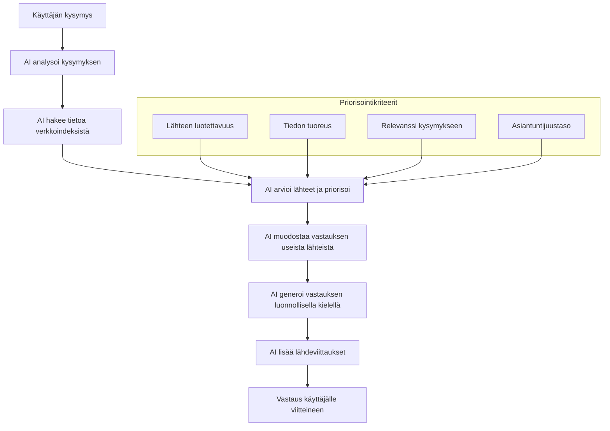

# Fixed Example: Generatiiviset hakukokemukset ja tekoäly

This is an example of how to fix the Mermaid diagram in the "Generatiiviset hakukokemukset ja tekoäly" document to ensure it renders properly with Finnish characters. The main change is to add quotes around the subgraph title "Priorisointikriteerit".

## Original Problematic Diagram

The original diagram had this syntax:

```
flowchart TB
    A[Käyttäjän kysymys] --> B[AI analysoi kysymyksen]
    B --> C[AI hakee tietoa verkkoindeksistä]
    C --> D[AI arvioi lähteet ja priorisoi]
    D --> E[AI muodostaa vastauksen useista lähteistä]
    E --> F[AI generoi vastauksen luonnollisella kielellä]
    F --> G[AI lisää lähdeviittaukset]
    G --> H[Vastaus käyttäjälle viitteineen]
    
    subgraph Priorisointikriteerit
    I[Lähteen luotettavuus]
    J[Tiedon tuoreus]
    K[Relevanssi kysymykseen]
    L[Asiantuntijuustaso]
    end
    
    I --> D
    J --> D
    K --> D
    L --> D
```

## Fixed Diagram

Here's the fixed version with proper quoting:



## What Changed?

The key change is quoting the subgraph title:

```
subgraph "Priorisointikriteerit"
```

Instead of:

```
subgraph Priorisointikriteerit
```

This ensures Mermaid correctly processes the Finnish characters in the subgraph title and renders the diagram properly.

## Other Potential Diagram Fixes

If you're still having issues with Finnish characters in your Mermaid diagrams, try these additional approaches:

1. Add quotes around edge labels with special characters:
   ```
   A -->|"Suomenkielinen teksti"| B
   ```

2. Use HTML entities for particularly problematic characters:
   ```
   A[K&auml;ytt&auml;j&auml;]
   ```

3. Ensure your Markdown file is saved with UTF-8 encoding.

For more detailed guidance, see the [Finnish Mermaid documentation](mermaid-finnish.md). 