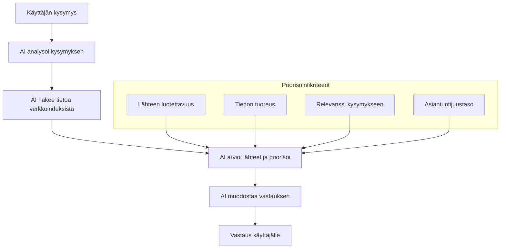
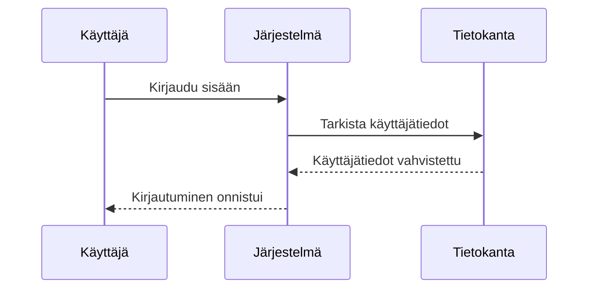
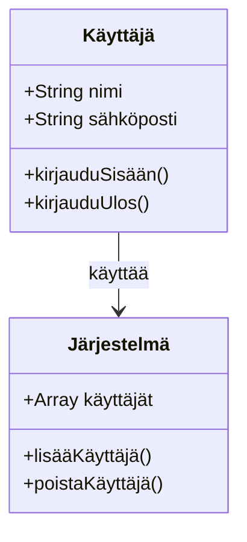
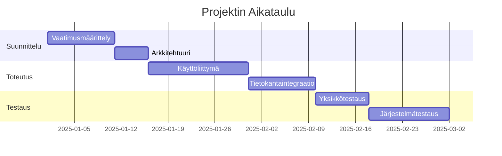

# Finnish Mermaid Diagram Example

This document provides a working example of a Mermaid diagram with Finnish text that should render correctly in MDViewer.

## Basic Flowchart with Finnish Text

## Sequence Diagram with Finnish Characters

## Class Diagram with Finnish Terms

## Gantt Chart with Finnish Project Names

## Tips for Creating Finnish Mermaid Diagrams

1. Always quote subgraph titles: `subgraph "Priorisointikriteerit"`
2. Keep node IDs simple (A, B, C) but feel free to use Finnish in the labels: `A[Käyttäjä]`
3. For edge labels with Finnish text, consider using quotes: `A -->|"Lähettää viestin"| B`
4. If you experience issues, try HTML entities as a fallback: `A[K&auml;ytt&auml;j&auml;]`

Refer to the [Creating Mermaid Diagrams with Finnish Text](mermaid-finnish.md) guide for more detailed information. 