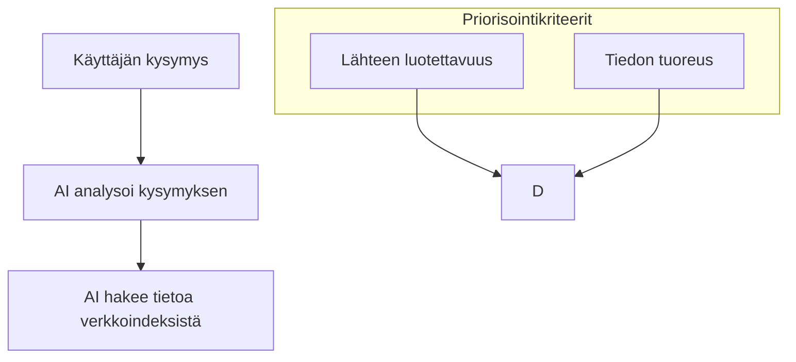
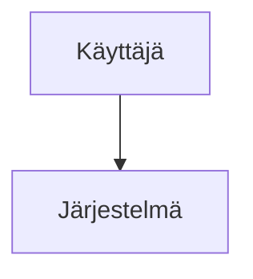

# Creating Mermaid Diagrams with Finnish Text

MDViewer supports Mermaid diagrams with Finnish characters, but there are some best practices to follow for optimal rendering.

## Best Practices

1. **Always Quote Subgraph Titles**:
   ```mermaid
   subgraph "Priorisointikriteerit"
   I[Lähteen luotettavuus]
   end
   ```

2. **Keep Node Labels Simple**:
   - Avoid special characters in node IDs (the letters before the brackets)
   - You can use Finnish characters freely in the node labels (inside brackets)
   ```mermaid
   graph TD
   A[Käyttäjä] --> B[Järjestelmä]
   ```

3. **Check Diagram Rendering**:
   - If your diagram doesn't render properly, try adding quotes around text with special characters
   - For complex diagrams, break them into smaller, more manageable sections

## Example with Finnish Characters



## Troubleshooting

If your diagrams still don't render properly:
1. Ensure your Markdown file is saved with UTF-8 encoding
2. Try simplifying complex diagrams
3. Check for balanced quotes, brackets, and parentheses
4. Make sure your subgraph titles are in quotes: `subgraph "Title with ä and ö"`
5. Verify there are no extra spaces before or after diagram definition

## Specific Issues with Finnish Characters

When working with characters like `ä`, `ö`, and other non-ASCII characters in Mermaid diagrams:

1. **Node IDs**: Keep node IDs simple (the letter before brackets):
   ```mermaid
   graph TD
   A[Tämä on hyvä] -->|Kyllä| B[Tämä myös toimii]
   ```

2. **Edge Labels**: Use quotes for edge labels with special characters:
   ```mermaid
   graph TD
   A --> |"Tämä yhteys"| B
   ```

3. **Avoid Special Characters in Critical Syntax**: Keep diagram syntax elements free of special characters

## Sample Diagram Fix

If you have a diagram like this that doesn't render:

```
flowchart TB
    A[Käyttäjän kysymys] --> B[AI analysoi kysymyksen]
    
    subgraph Priorisointikriteerit
    I[Lähteen luotettavuus]
    end
```

Change it to:

```
flowchart TB
    A[Käyttäjän kysymys] --> B[AI analysoi kysymyksen]
    
    subgraph "Priorisointikriteerit"
    I[Lähteen luotettavuus]
    end
```

## Advanced Character Support

If you're experiencing persistent issues with certain characters, you can use HTML entities as a fallback:

| Character | HTML Entity |
|-----------|------------|
| ä | &auml; |
| ö | &ouml; |
| å | &aring; |

Example:
