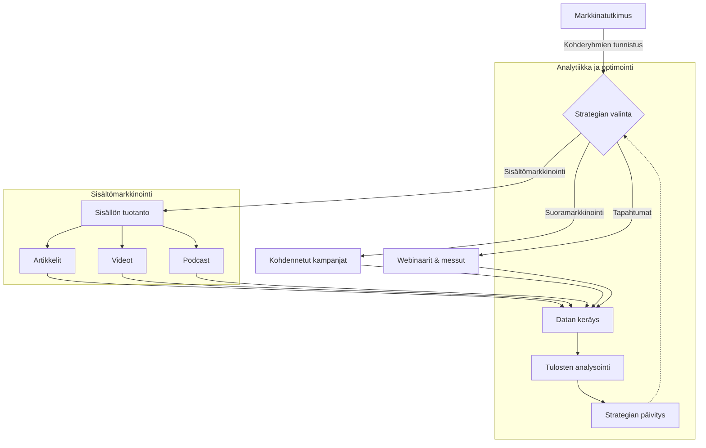
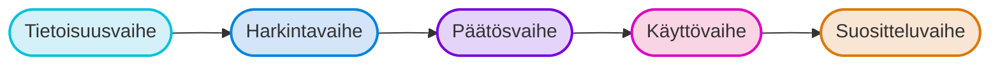
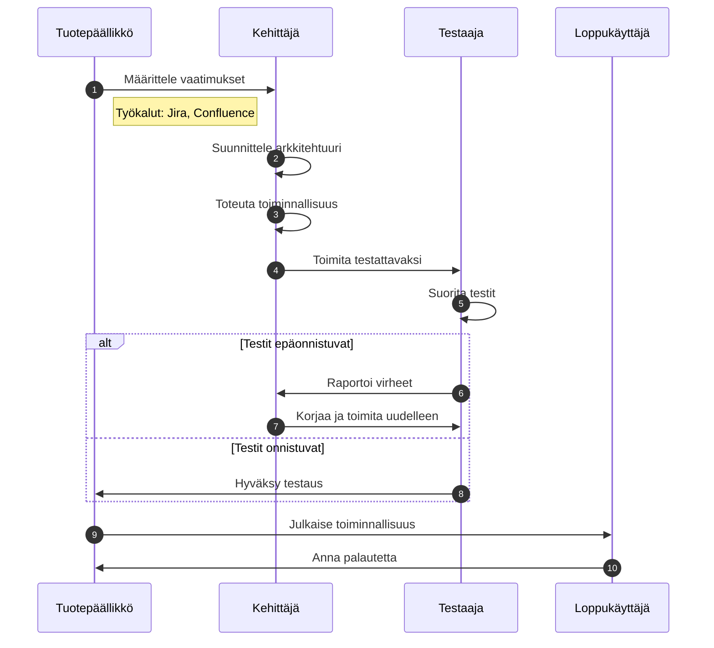

# Modern Styled Mermaid Diagrams

This file showcases Mermaid diagrams with improved styling.

## B2B Marketing Process

```mermaid
flowchart TB
    A[Markkinatutkimus] -->|Kohderyhmien tunnistus| B{Strategian valinta}
    
    B -->|Sisältömarkkinointi| C[Sisällön tuotanto]
    B -->|Suoramarkkinointi| D[Kohdennetut kampanjat]
    B -->|Tapahtumat| E[Webinaarit & messut]
    
    subgraph "Sisältömarkkinointi"
    C --> F[Artikkelit]
    C --> G[Videot]
    C --> H[Podcast]
    end
    
    subgraph "Analytiikka ja optimointi"
    I[Datan keräys] --> J[Tulosten analysointi]
    J --> K[Strategian päivitys]
    K -.-> B
    end
    
    F --> I
    G --> I
    H --> I
    D --> I
    E --> I
```

## Käyttäjän asiakasmatka

```mermaid
flowchart LR
    A([Tietoisuusvaihe]) --> B([Harkintavaihe])
    B --> C([Päätösvaihe])
    C --> D([Käyttövaihe])
    D --> E([Suositteluvaihe])
    
    style A fill:#d4f1f9,stroke:#05c2de,stroke-width:2px
    style B fill:#d4e5f9,stroke:#0584de,stroke-width:2px
    style C fill:#e5d4f9,stroke:#7805de,stroke-width:2px
    style D fill:#f9d4e5,stroke:#de05c2,stroke-width:2px
    style E fill:#f9e5d4,stroke:#de7805,stroke-width:2px
```

## Feature Implementation Process

```mermaid
sequenceDiagram
    autonumber
    participant PO as Tuotepäällikkö
    participant Dev as Kehittäjä
    participant QA as Testaaja
    participant User as Loppukäyttäjä
    
    PO->>Dev: Määrittele vaatimukset
    Note right of PO: Työkalut: Jira, Confluence
    
    Dev->>Dev: Suunnittele arkkitehtuuri
    Dev->>Dev: Toteuta toiminnallisuus
    Dev->>QA: Toimita testattavaksi
    
    QA->>QA: Suorita testit
    alt Testit epäonnistuvat
        QA->>Dev: Raportoi virheet
        Dev->>QA: Korjaa ja toimita uudelleen
    else Testit onnistuvat
        QA->>PO: Hyväksy testaus
    end
    
    PO->>User: Julkaise toiminnallisuus
    User->>PO: Anna palautetta
``` 