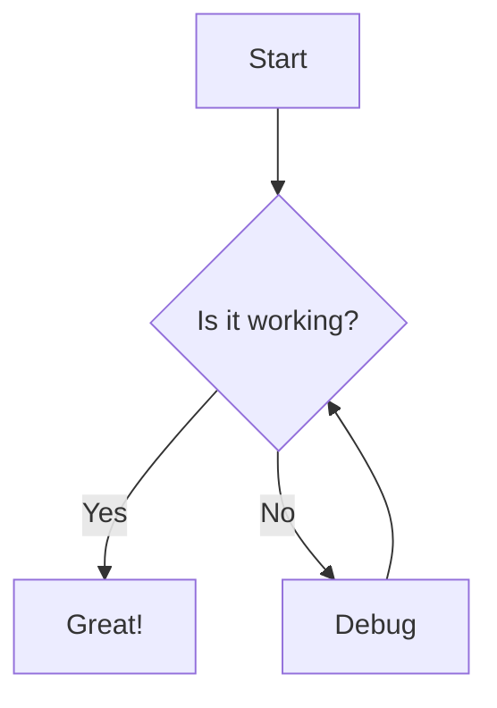
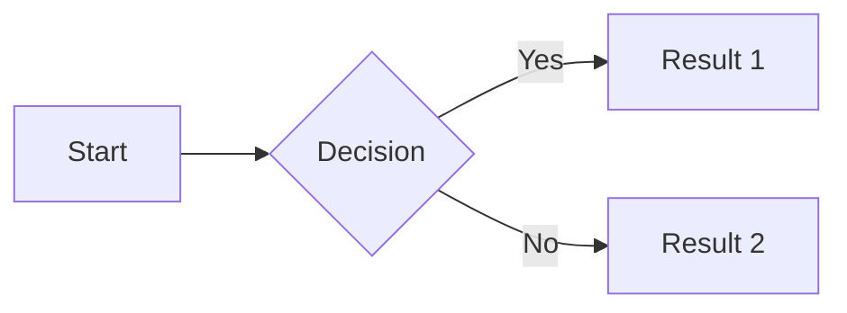
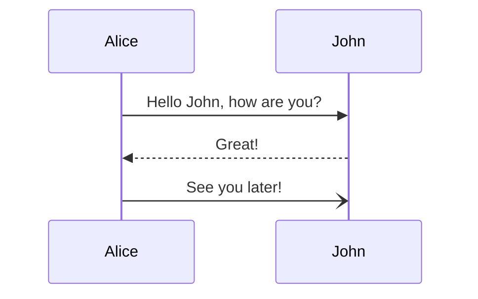
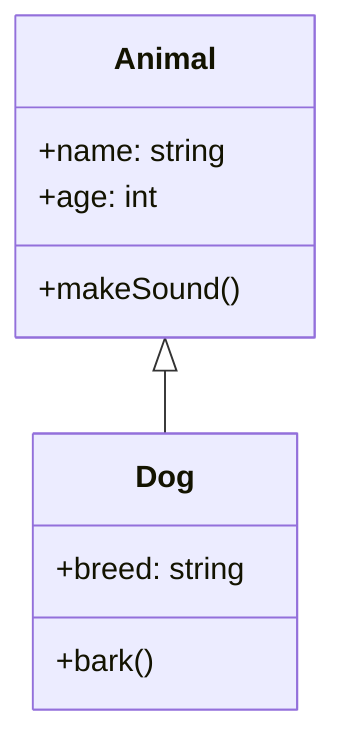

# Mermaid Diagram Support

MDViewer now includes full support for Mermaid diagrams! This feature allows you to create and visualize diagrams directly within your markdown documents.

## What is Mermaid?

[Mermaid](https://mermaid.js.org/) is a JavaScript-based diagramming and charting tool that renders Markdown-inspired text definitions to create and modify diagrams dynamically. It allows you to create:

- Flowcharts
- Sequence diagrams
- Class diagrams
- State diagrams
- Entity Relationship diagrams
- User Journey diagrams
- Gantt charts
- Pie charts
- Git graphs
- And more!

## How to Use Mermaid in MDViewer

To create a Mermaid diagram in your markdown document, simply use a code block with the `mermaid` language identifier:

````markdown

````

When the markdown is rendered, MDViewer will automatically process these code blocks and display the corresponding diagrams.

## Supported Diagram Types

As of May 2025, MDViewer supports all the latest Mermaid diagram types, including:

### Flowcharts

````markdown

````

### Sequence Diagrams

````markdown

````

### Class Diagrams

````markdown

````

## Theme Support

Mermaid diagrams automatically adapt to the MDViewer's current theme. In light mode, diagrams use a light background with dark elements, while in dark mode, diagrams switch to a dark background with light elements for better readability.

## International Language Support

MDViewer supports Mermaid diagrams with international characters, including Finnish, Swedish, German, and other languages with special characters. When creating diagrams with non-ASCII characters:

1. Always quote subgraph titles with special characters:
   ```mermaid
   subgraph "Priorisointikriteerit"
   I[Lähteen luotettavuus]
   end
   ```

2. Use straightforward node IDs while keeping special characters in node labels:
   ```mermaid
   graph TD
   A[Käyttäjä] --> B[Järjestelmä]
   ```

For more details and examples, see:
- [Creating Mermaid Diagrams with Finnish Text](mermaid-finnish.md)
- [Finnish Mermaid Diagram Examples](mermaid-finnish-example.md)

## Performance Considerations

While Mermaid is powerful, complex diagrams may impact performance. Keep these tips in mind:

- Large diagrams might take longer to render
- Consider breaking very complex diagrams into smaller ones
- Extremely large datasets in pie charts or Gantt charts might slow down rendering
- Diagrams with many special characters might require more processing

## Troubleshooting

If your diagram doesn't render correctly:

1. Check the syntax for errors
2. Ensure there are no blank lines at the beginning or end of the diagram code
3. Make sure the diagram definition is using the correct syntax for your diagram type
4. Verify that the code block has `mermaid` as the language identifier
5. For diagrams with special characters, refer to our [Finnish Mermaid guide](mermaid-finnish.md) for best practices
6. Try quoting text with special characters, especially in subgraph titles

## Examples

Check out the [Mermaid Example page](/examples/mermaid) to see all the supported diagram types in action.

## Resources

- [Official Mermaid Documentation](https://mermaid.js.org/intro/)
- [Mermaid Live Editor](https://mermaid.live/) - Test your diagrams before adding them to your documents
- [Mermaid Cheat Sheet](https://jojozhuang.github.io/tutorial/mermaid-cheat-sheet/)
- [Finnish Mermaid Examples](mermaid-finnish-example.md) - Examples of Mermaid diagrams with Finnish text
- [Technical Improvements Documentation](mermaid-improvements.md) - Information for developers about enhancing Mermaid support 