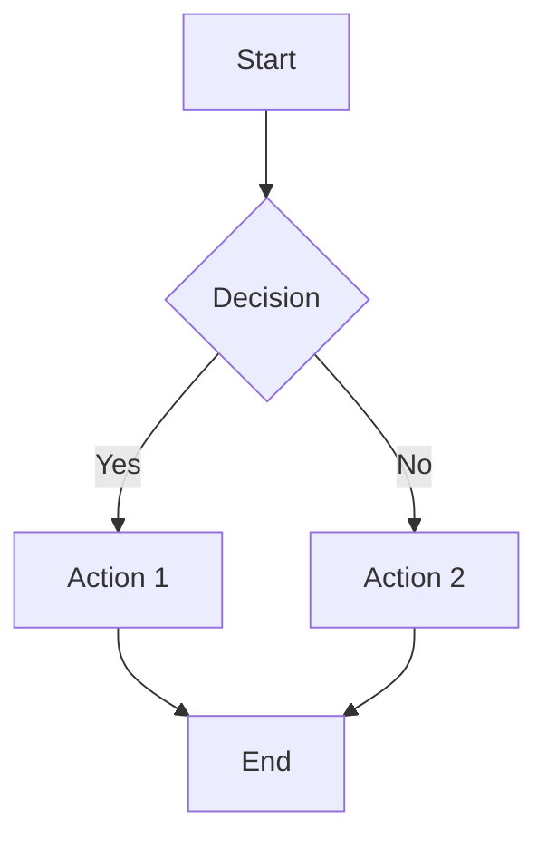
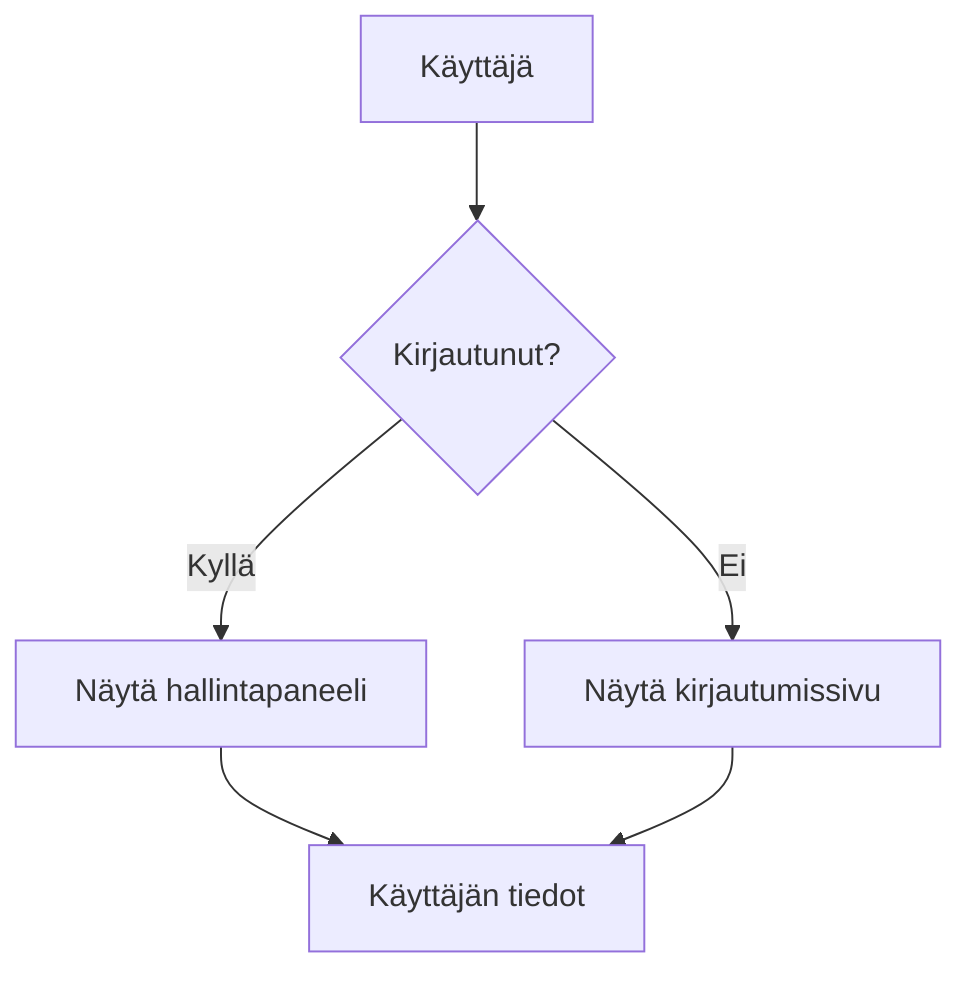
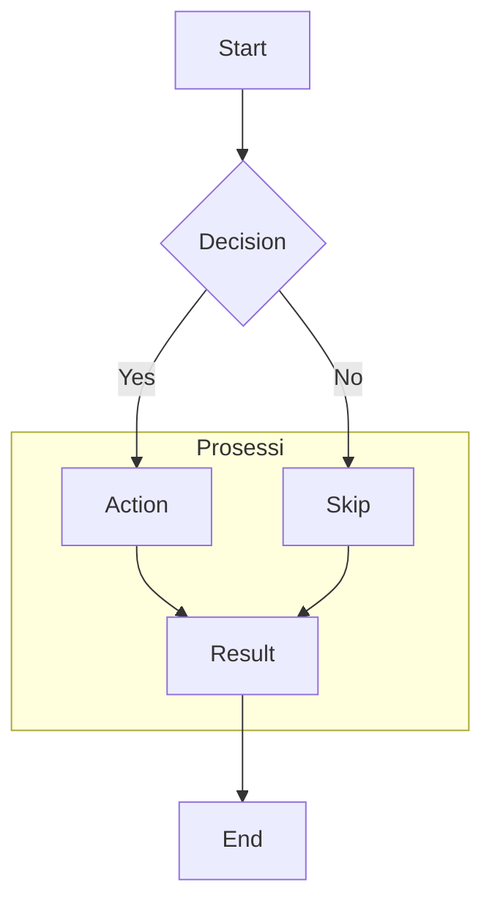
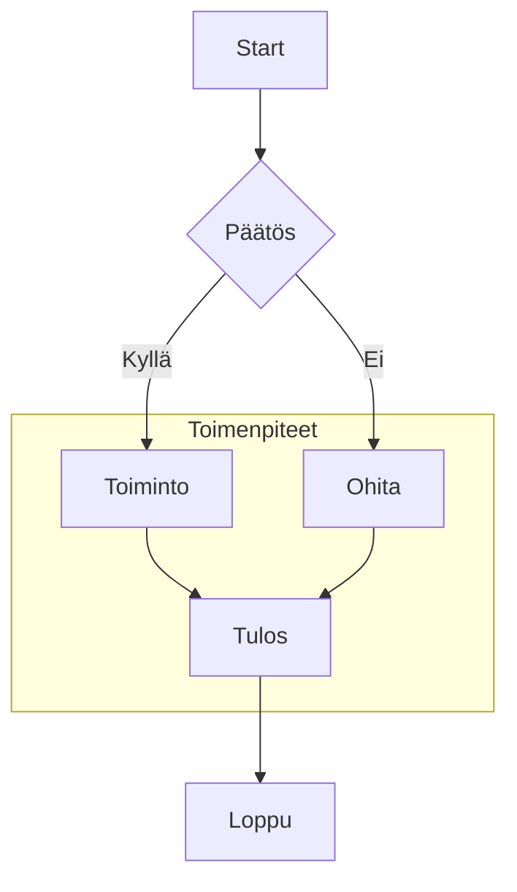
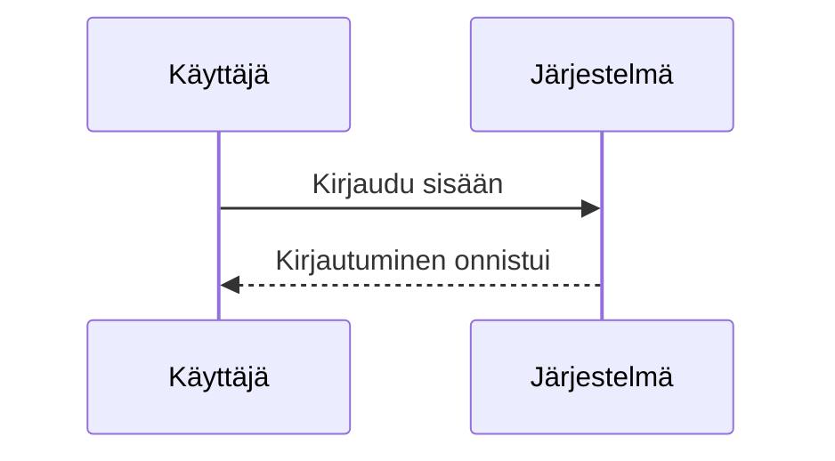

# Mermaid Test File

This file contains various Mermaid diagram formats to test rendering.

## Standard Mermaid Codeblock

## Mermaid With Finnish Characters

## Mermaid With Subgraph

## Mermaid With Finnish Subgraph

## Sequence Diagram

## No Language Tag (should be detected)

flowchart TB
    A[Auto-detect] --> B{Works?}
    B -->|Yes| C[Great!]
    B -->|No| D[Debug] 