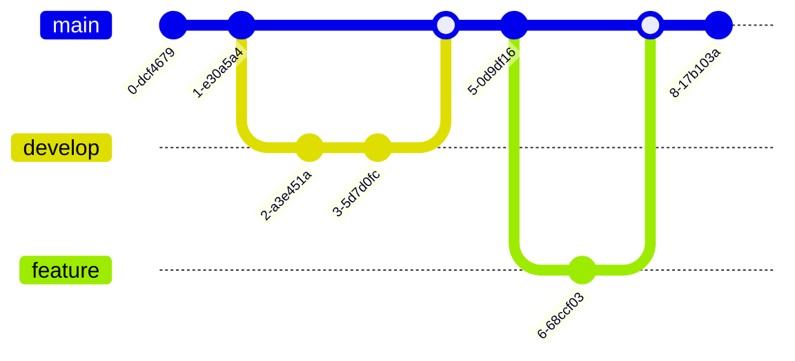

# Mermaid Diagrams in MDViewer

This page demonstrates the Mermaid diagram integration in the MDViewer application.

## Flowchart Example

## Sequence Diagram Example

## Class Diagram Example

## State Diagram Example

## Gantt Chart Example

## Pie Chart Example

## Git Graph Example

---

All of these diagrams are rendered directly in the browser using Mermaid.js integration. You can create your own diagrams using the Mermaid syntax in code blocks with the `mermaid` language identifier. 